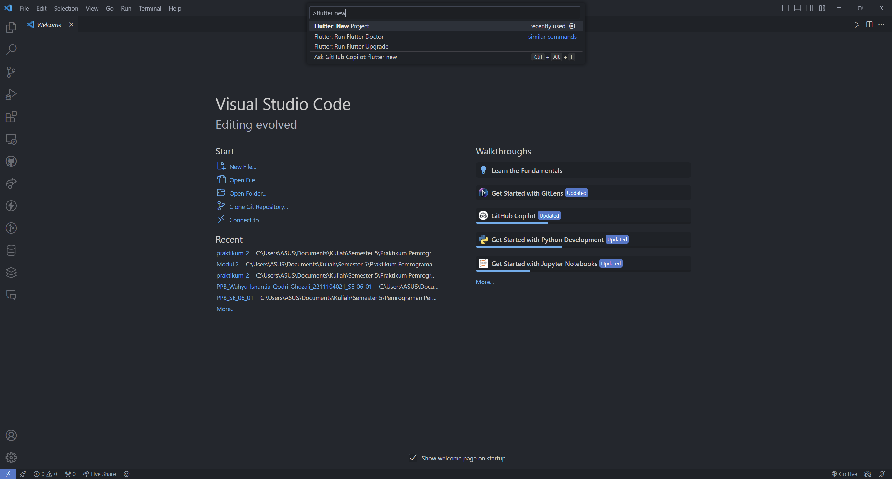
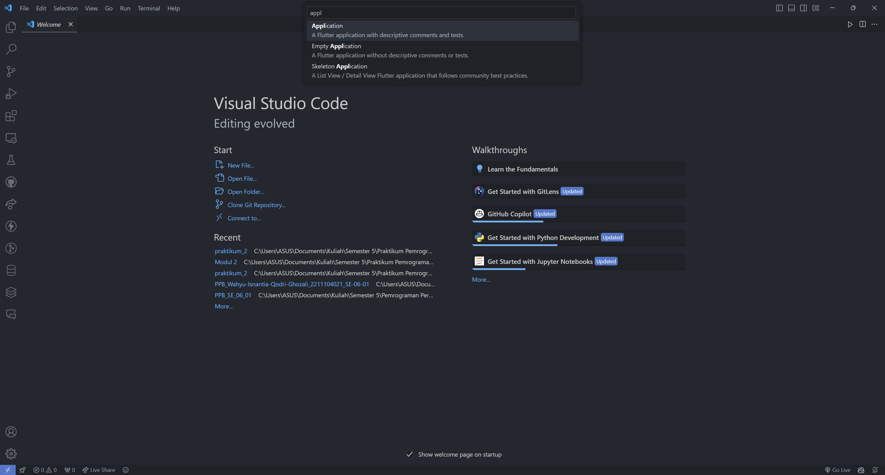
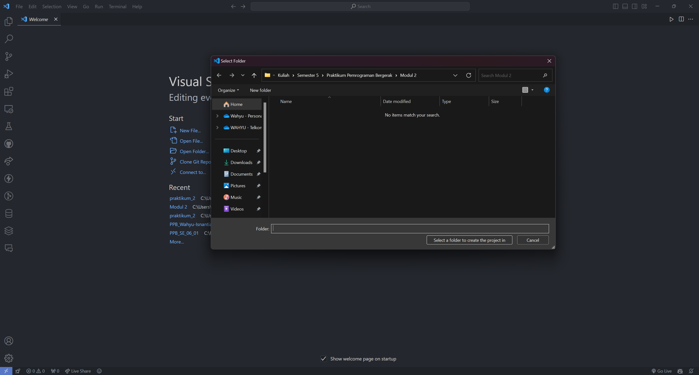
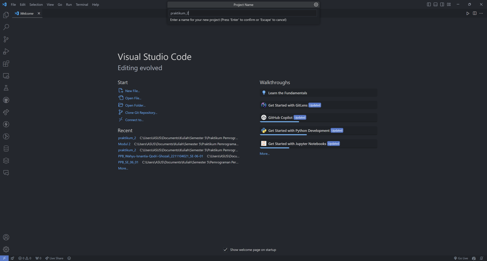
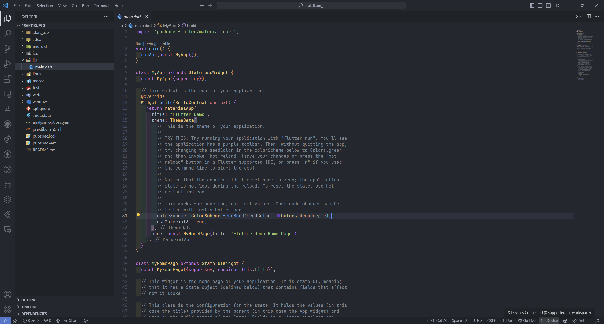
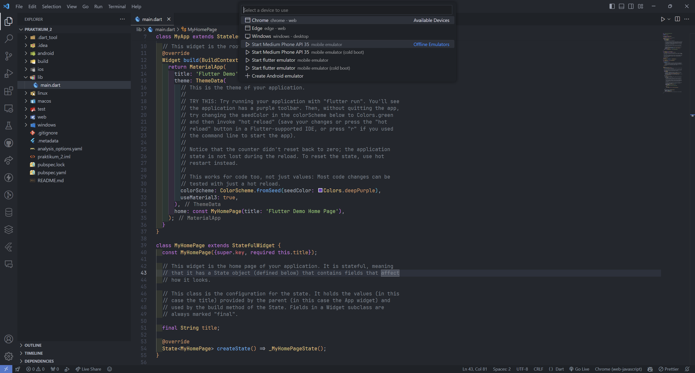
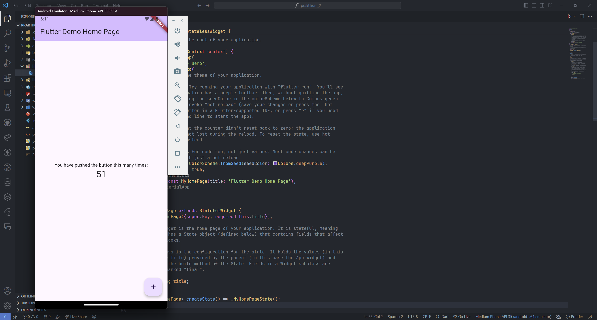
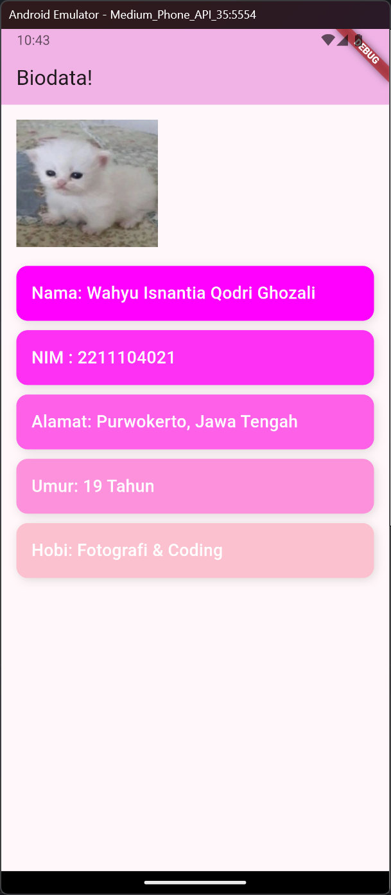

<li> Nama  : Wahyu Isnantia Qodri Ghozali </li>
<li> NIM   : 2211104021 </li>
<li> Kelas : SE-06-01 </li>

# Pengenalan Flutter

# ➡️Dart⬅️

Dart adalah sebuah bahasa pemrograman yang dikembangkan oleh Google dan merupakan bahasa pemrograman resmi untuk Flutter, sebuah UI toolkit dan aplikasi multiplatform dari Google.

# ➡️Flutter⬅️

Flutter adalah platform yang digunakan untuk membuat aplikasi multiplatform dengan satu basis coding (codebase). Artinya, aplikasi yang dihasilkan dapat dipakai di berbagai platform, baik mobile Android, iOS, web, maupun desktop

# ➡️Contoh widget di Flutter⬅️

Widget adalah komponen utama yang digunakan untuk membuat antarmuka pengguna (UI) dalam aplikasi Flutter. Widget merupakan blok penyusun dasar yang menentukan apa yang terlihat di layar, bagaimana perilakunya, dan bagaimana widget berinteraksi dengan elemen lain, contoh nya:
<ol>
    <li>Container
    <li>Row
    <li>Column
    <li>Stack
    <li>Expanded
</ol>

# ➡️Membuat Project Flutter⬅️

Tekan Ctrl + Shift + P atau Command + Shift + P, dan ketik "Flutter New Project".

Lalu pilih Application.

Lalu pilih dimana project akan disimpan.

Ketik nama project dan tekan Enter.

# ➡️Running⬅️

Pilih Emulator yang ingin digunakan di kanan bawah VSCode.

Disini saya pilih emulator Android API 35.

Tunggu beberapa saat lalu akan muncul emulatornya.

# ➡️Modifikasi⬅️

Setelah modifikasi untuk menambahkan 5 widgets, maka tampilan akan seperti ini.

