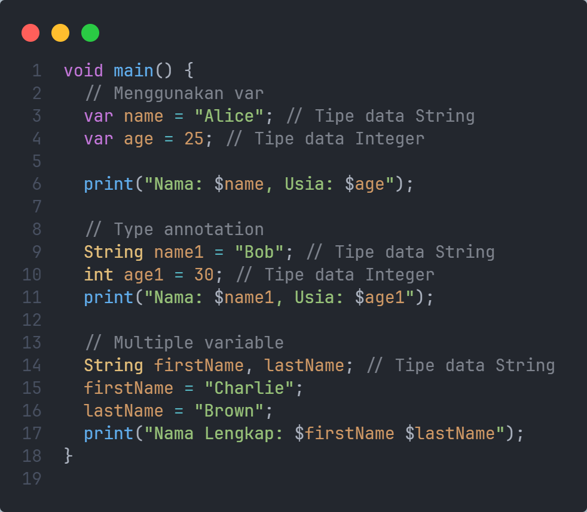
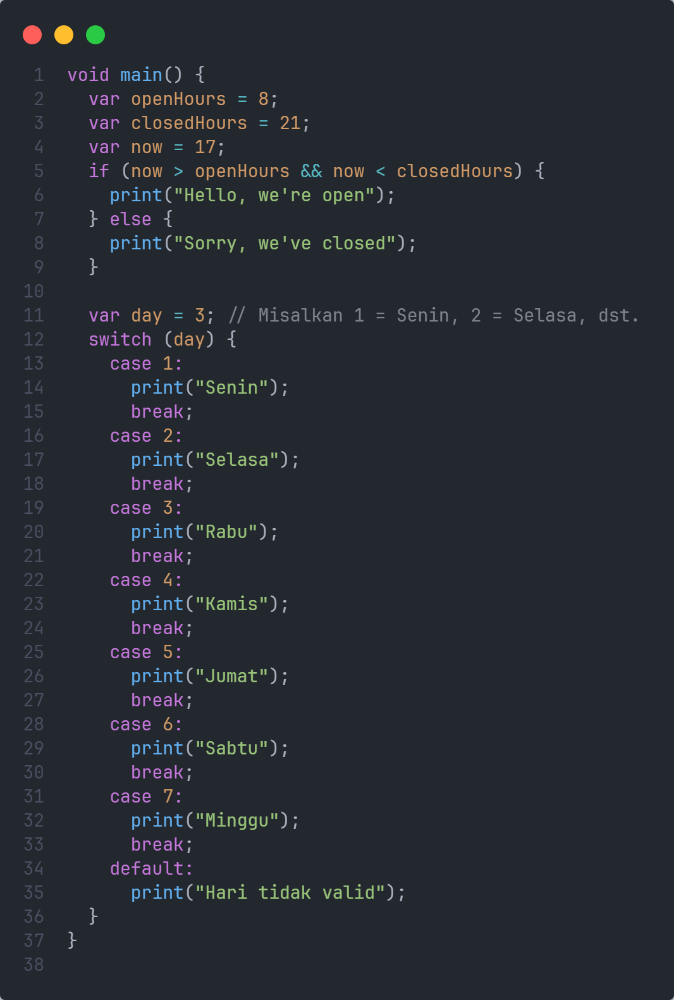
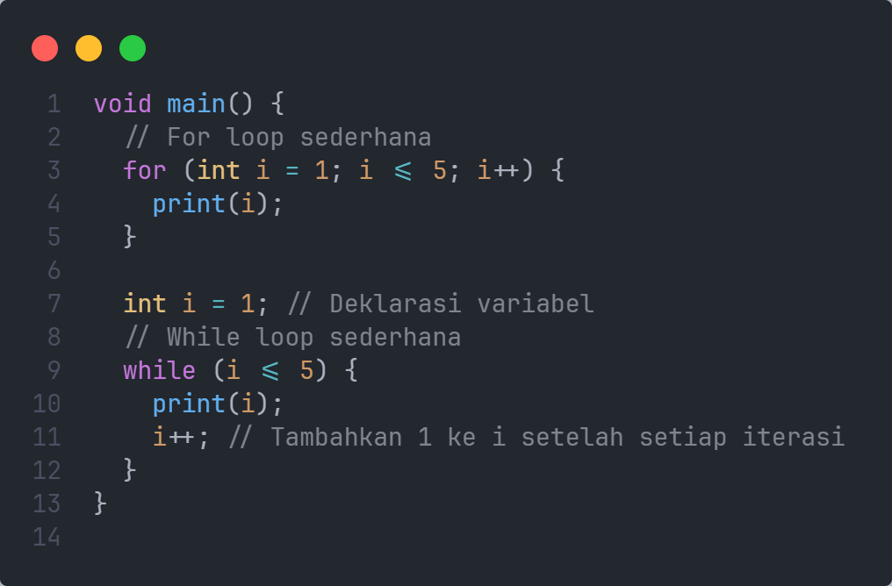
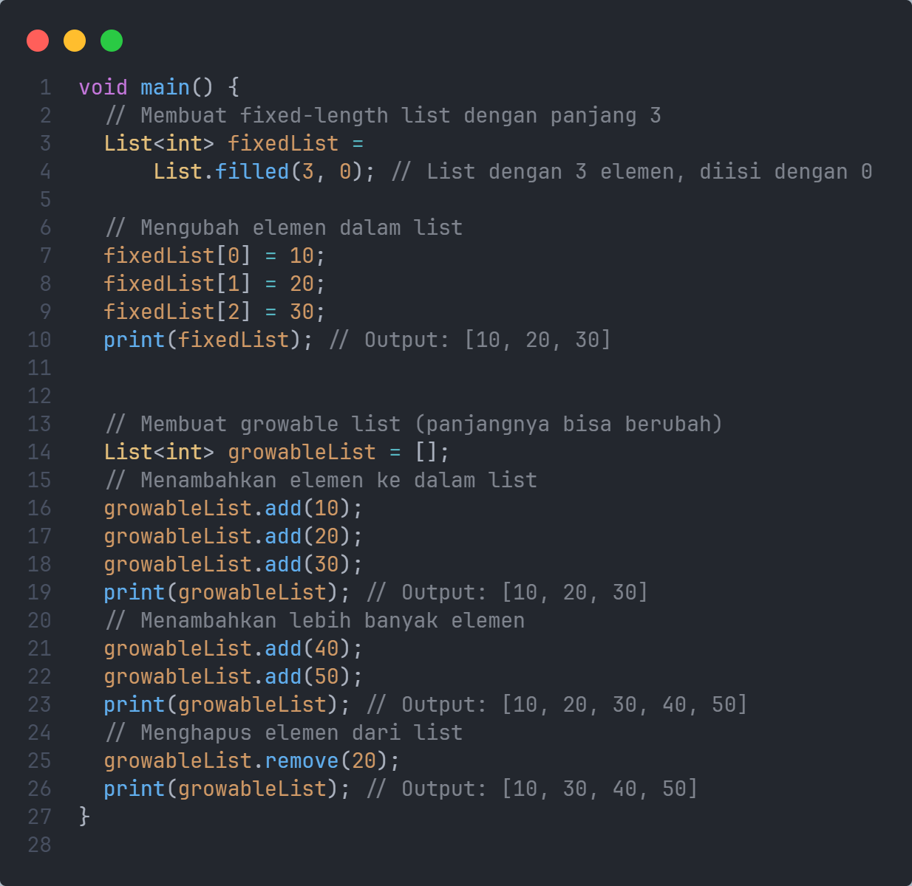
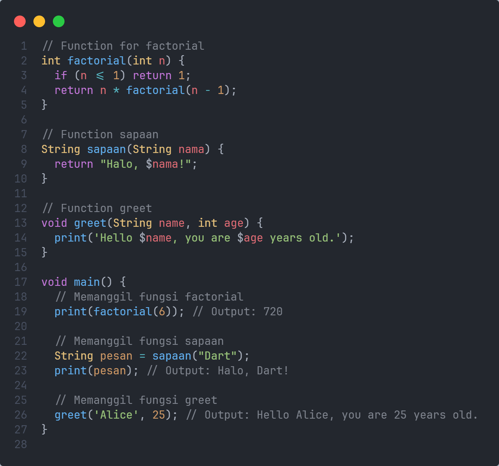
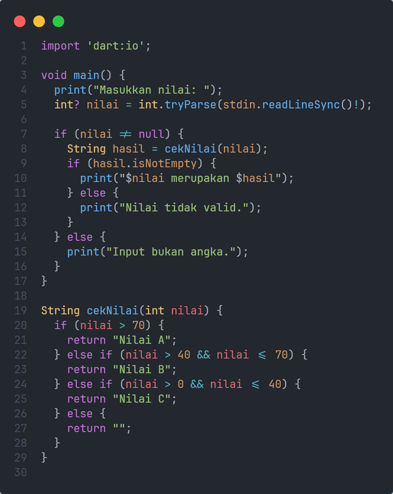
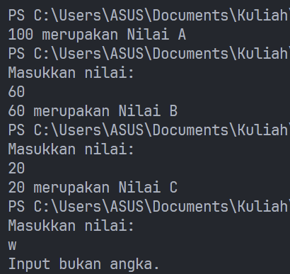
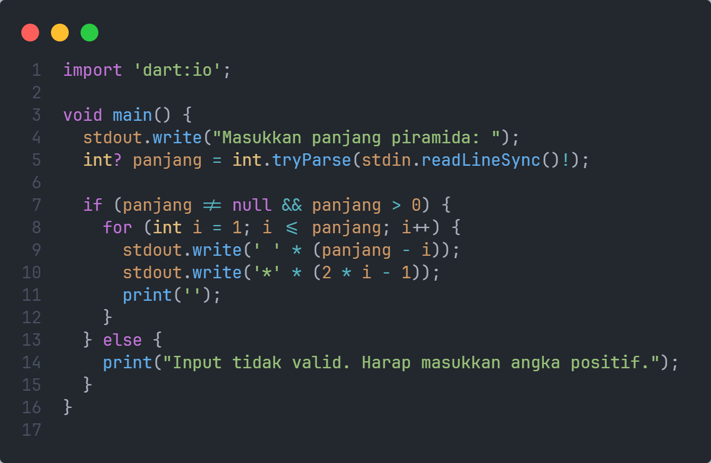
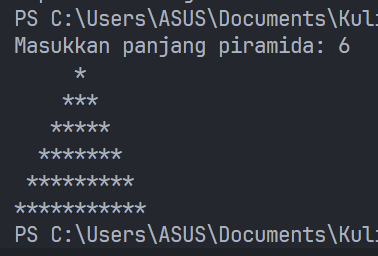
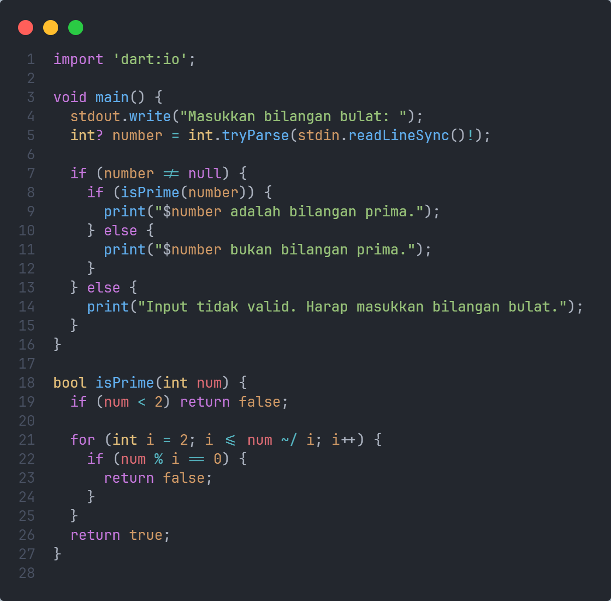

# Cover #

TUGAS PENDAHULUAN  
PEMROGRAMAN PERANGKAT BERGERAK  
 
MODUL III  
PENGENALAN DART  

 

Disusun Oleh:  
Wahyu Isnantia Qodri Ghozali/2211104021  
SE-06-01  

 

Asisten Praktikum :  
Muhammad Faza Zulian Gesit Al Barru  
Aisyah Hasna Aulia  

 

Dosen Pengampu :  
Yudha Islami Sulistya, S.Kom., M.Cs  

 

PROGRAM STUDI S1 REKAYASSA PERANGKAT LUNAK  
FAKULTAS INFORMATIKA   
TELKOM UNIVERSITY PURWOKERTO  

# Guided
 

1. Variable  
   Source code:  
   
     
2. Statement  
   Source code:  
   
     
3. Looping  
   Source code:  
   
     
4. List  
   Source code:  
   
     
5. Fungsi  
   Source code:  
   
     

# Unguided
 
1. SOAL NOMOR 1  
   Source Code:  
   
    
   Output:  
   
    
   Penjelasan: 
   Program meminta input dari user dan mengonversinya menjadi integer. Jika inputnya valid, maka memeriksa kondisi nilai menggunakan if-else dan mengembalikan "Nilai A", "Nilai B", atau "Nilai C" sesuai dengan rentang yang diberikan. Jika tidak memenuhi memasukan integer, program akan mengembalikan string kosong dan mencetak pesan "Input bukan angka".

2. SOAL NOMOR 2  
   Source Code:  
   
    
   Output:  
   
    
   Penjelasan: 
   Program akan meminta user integer untuk menentukan panjang piramida, lalu menampilkan piramida, loop dimulai dari i = 1 hingga i mencapai panjang piramida yang diinputkan oleh user. Di setiap iterasi, program mencetak spasi sebanyak (panjang - i) untuk menjaga format piramida tetap simetris, lalu mencetak bintang (*) sebanyak (2 * i - 1) agar jumlah bintang bertambah di setiap baris. Ini menciptakan bentuk piramida, dengan baris pertama memiliki satu bintang dan baris berikutnya memiliki jumlah bintang yang bertambah dua di setiap level.

3. SOAL NOMOR 3  
   Source Code:  
   
    
   Output:  
   
    
   Penjelasan: 
   Program akan meminta input integer ke user, lalu mengecek apakah bilangan itu bilangan prima atau bukan dengan fungsi isPrime(), ini akan mengecek apakah bilangan memiliki pembagi selain 1 dan bilangan itu sendiri, jika ada maka bilangan itu bukan prima, jika tidak ada maka bilangan itu adalah bilangan prima.