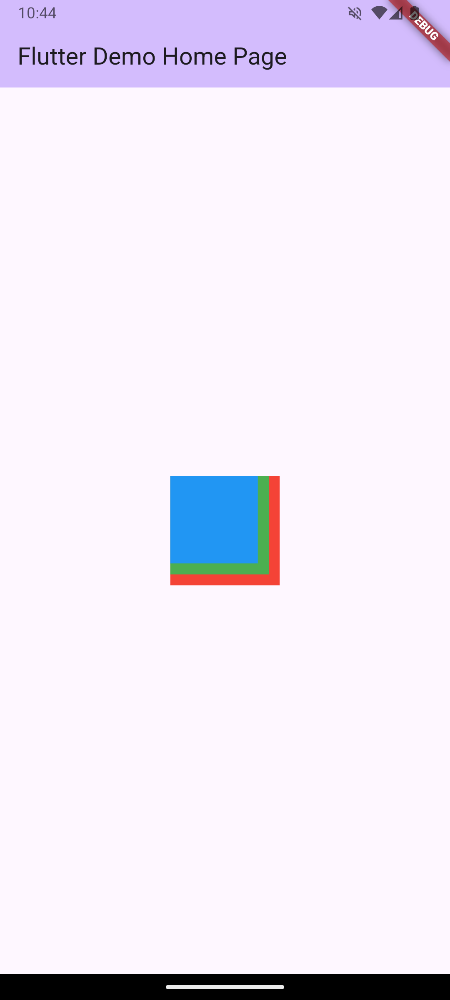

# Cover #
<div align="center">
TUGAS PENDAHULUAN <br>
PEMROGRAMAN PERANGKAT BERGERAK <br>
<br>
MODUL IV <br>
ANTARMUKA PENGGUNA <br>


<br>

Disusun Oleh: <br>
Wahyu Isnantia Qodri Ghozali/2211104021 <br>
SE-06-01 <br>

<br>

Asisten Praktikum : <br>
Muhammad Faza Zulian Gesit Al Barru <br>
Aisyah Hasna Aulia <br>

<br>

Dosen Pengampu : <br>
Yudha Islami Sulistya, S.Kom., M.Cs <br>

<br>

PROGRAM STUDI S1 REKAYASSA PERANGKAT LUNAK <br>
FAKULTAS INFORMATIKA <br> 
TELKOM UNIVERSITY PURWOKERTO <br>

</div>

# Guided

## 1. Pengenalan Widget <br>
   
   Jenis-jenis Layout pada Flutter
   1) Container
    Adalah widget dasar yang digunakan untuk menentukan batasan atau constraints dari child widget-nya. Container dapat diisi dengan berbagai jenis child widget seperti : text, image, atau bahkan layout widget lainnya.
   2) Row dan Column Adalah layout widget yang digunakan untuk mengatur child widget secara horizontal atau vertical.
   3) Stack Adalah layout widget yang digunakan untuk menumpuk beberapa widget di atau satu sama lain.
   4) Expanded dan Flexible Adalah widget yang digunakan untuk mengatur bagaimana child widget mengisi ruang yang tersedia. Expanded akan memberikan semua ruang yang tersedia ke child widget, sedangkan Flexible akan memberikan sejumlah ruang yang dapat berubahubah sesuai dengan kondisi yang ada.
   5) ListView Adalah widget yang digunakan untuk menampilkan daftar item yang dapat di-scroll.
   6) GridView Adalah widget yang digunakan untuk menampilkan daftar item dalam bentuk grid.
   7) Wrap Adalah widget yang digunakan untuk menampilkan child widget dalam baris atau kolom. Jika child widget melebihi lebar atau tinggi dari wrap, maka widget tersebut akan dibungkus ke baris atau kolom berikutnya.
   8) Table Adalah widget yang digunakan untuk menampilkan data dalam bentuk tabel. TableRow untuk menambahkan baris, dan TableCell untuk menambahkan kolom.
   
## 2. GridView <br>
Source Code ```main.dart```:
```
import 'package:flutter/material.dart';

void main() {
  runApp(const MyApp());
}

class MyApp extends StatelessWidget {
  const MyApp({super.key});
  @override
  Widget build(BuildContext context) {
    return MaterialApp(
      title: 'Flutter Demo',
      theme: ThemeData(
        colorScheme: ColorScheme.fromSeed(seedColor: Colors.deepPurple),
        useMaterial3: true,
      ),
      home: const MyHomePage(title: 'Flutter Demo Home Page'),
    );
  }
}

class MyHomePage extends StatefulWidget {
  const MyHomePage({super.key, required this.title});
  final String title;

  @override
  State<MyHomePage> createState() => _MyHomePageState();
}

class _MyHomePageState extends State<MyHomePage> {
  @override
  Widget build(BuildContext context) {
    return Scaffold(
      appBar: AppBar(
        backgroundColor: Theme.of(context).colorScheme.inversePrimary,
        title: Text(widget.title),
      ),
      body: Center(
        child: GridView.count(
          primary: false,
          padding: const EdgeInsets.all(20),
          crossAxisSpacing: 10,
          mainAxisSpacing: 10,
          crossAxisCount: 2,
          children: <Widget>[
            Container(
              padding: const EdgeInsets.all(8),
              child: const Text("He'd have you all unravel at the"),
              color: Colors.teal[100],
            ),
            Container(
              padding: const EdgeInsets.all(8),
              color: Colors.teal[200],
              child: const Text('Heed not the rabble'),
            ),
            Container(
              padding: const EdgeInsets.all(8),
              color: Colors.teal[300],
              child: const Text('Sound of screams but the'),
            ),
            Container(
              padding: const EdgeInsets.all(8),
              color: Colors.teal[400],
              child: const Text('Who scream'),
            ),
            Container(
              padding: const EdgeInsets.all(8),
              color: Colors.teal[500],
              child: const Text('Revolution is coming...'),
            ),
            Container(
              padding: const EdgeInsets.all(8),
              color: Colors.teal[600],
              child: const Text('Revolution, they...'),
            ),
          ],
        ),
      ),
    );
  }
}

```
Output Code:<br>


## 3. ListView <br>
   
Source Code ```main.dart```:

```
import 'package:flutter/material.dart';
import 'package:praktikum4_2/list_view.dart';

void main() {
  runApp(const MyApp());
}

class MyApp extends StatelessWidget {
  const MyApp({super.key});

  @override
  Widget build(BuildContext context) {
    return MaterialApp(
      title: 'Flutter Demo',
      theme: ThemeData(
        colorScheme: ColorScheme.fromSeed(seedColor: Colors.deepPurple),
        useMaterial3: true,
      ),
      home: const ListViewApp(),
    );
  }
}

class MyHomePage extends StatefulWidget {
  const MyHomePage({super.key, required this.title});
  final String title;

  @override
  State<MyHomePage> createState() => _MyHomePageState();
}

class _MyHomePageState extends State<MyHomePage> {
  @override
  Widget build(BuildContext context) {
    return Scaffold(
      appBar: AppBar(
        backgroundColor: Theme.of(context).colorScheme.inversePrimary,
        title: Text(widget.title),
      ),
      body: GridView.count(
        primary: false,
        padding: const EdgeInsets.all(20),
        crossAxisSpacing: 10,
        mainAxisSpacing: 10,
        crossAxisCount: 2,
        children: <Widget>[
          Container(
            padding: const EdgeInsets.all(8),
            color: const Color.fromARGB(255, 255, 187, 0),
            child: const Column(
              mainAxisAlignment: MainAxisAlignment.center,
              children: [
                Icon(Icons.wifi),
                SizedBox(height: 8),
                Text("WI-FI"),
              ],
            ),
          ),
          Container(
            padding: const EdgeInsets.all(8),
            color: const Color.fromARGB(255, 106, 0, 255),
            child: const Column(
              mainAxisAlignment: MainAxisAlignment.center,
              children: [
                Icon(Icons.local_drink),
                SizedBox(height: 8),
                Text("Free Drinks"),
              ],
            ),
          ),
          Container(
            padding: const EdgeInsets.all(8),
            color: const Color.fromARGB(255, 255, 0, 183),
            child: const Column(
              mainAxisAlignment: MainAxisAlignment.center,
              children: [
                Icon(Icons.no_photography),
                SizedBox(height: 8),
                Text('No Photography'),
              ],
            ),
          ),
          Container(
            padding: const EdgeInsets.all(8),
            color: const Color.fromARGB(255, 0, 255, 229),
            child: const Column(
              mainAxisAlignment: MainAxisAlignment.center,
              children: [
                Icon(Icons.no_adult_content),
                SizedBox(height: 8),
                Text('No Adults Content'),
              ],
            ),
          ),
        ],
      ),
    );
  }
}
```
Source Code ```list_view.dart```
```
import 'package:flutter/material.dart';

class ListViewApp extends StatelessWidget {
  const ListViewApp({super.key});

  @override
  Widget build(BuildContext context) {
    return MaterialApp(
      title: 'Flutter Demo',
      theme: ThemeData(
        colorScheme: ColorScheme.fromSeed(seedColor: Colors.deepPurple),
        useMaterial3: true,
      ),
      home: const MyHomePage(title: 'Flutter Demo Home Page'),
    );
  }
}

class MyHomePage extends StatefulWidget {
  const MyHomePage({super.key, required this.title});
  final String title;

  @override
  State<MyHomePage> createState() => _MyHomePageState();
}

class _MyHomePageState extends State<MyHomePage> {
  @override
  Widget build(BuildContext context) {
    return Scaffold(
      appBar: AppBar(
        backgroundColor: Theme.of(context).colorScheme.inversePrimary,
        title: Text(widget.title),
      ),
      body: ListView(
        padding: const EdgeInsets.all(8),
        children: <Widget>[
          Container(
            height: 50,
            color: Colors.amber[600],
            child: const Center(child: Text('Entry A')),
          ),
          Container(
            height: 50,
            color: Colors.amber[500],
            child: const Center(child: Text('Entry B')),
          ),
          Container(
            height: 50,
            color: Colors.amber[100],
            child: const Center(child: Text('Entry C')),
          ),
        ],
      ),
    );
  }
}
```

Output Code:<br>


## 4. Stack

Source Code ```main.dart```:
```
import 'package:flutter/material.dart';

void main() {
  runApp(const MyApp());
}

class MyApp extends StatelessWidget {
  const MyApp({super.key});

  @override
  Widget build(BuildContext context) {
    return MaterialApp(
      title: 'Flutter Demo',
      theme: ThemeData(
        colorScheme: ColorScheme.fromSeed(seedColor: Colors.deepPurple),
        useMaterial3: true,
      ),
      home: const MyHomePage(title: 'Flutter Demo Home Page'),
    );
  }
}

class MyHomePage extends StatefulWidget {
  const MyHomePage({super.key, required this.title});
  final String title;

  @override
  State<MyHomePage> createState() => _MyHomePageState();
}

class _MyHomePageState extends State<MyHomePage> {
  @override
  Widget build(BuildContext context) {
    return Scaffold(
      appBar: AppBar(
        backgroundColor: Theme.of(context).colorScheme.inversePrimary,
        title: Text(widget.title),
      ),
      body: Center(
        child: Stack(
          children: <Widget>[
            Container(
              width: 100,
              height: 100,
              color: Colors.red,
            ),
            Container(
              width: 90,
              height: 90,
              color: Colors.green,
            ),
            Container(
              width: 80,
              height: 80,
              color: Colors.blue,
            ),
          ],
        ),
      ),
    );
  }
}
```

Output Code:<br>


### Stack Foreground
Source Code ```main.dart```:
```
import 'package:flutter/material.dart';

void main() {
  runApp(const MyApp());
}

class MyApp extends StatelessWidget {
  const MyApp({super.key});

  @override
  Widget build(BuildContext context) {
    return MaterialApp(
      title: 'Flutter Demo',
      theme: ThemeData(
        colorScheme: ColorScheme.fromSeed(seedColor: Colors.deepPurple),
        useMaterial3: true,
      ),
      home: const MyHomePage(title: 'Flutter Demo Home Page'),
    );
  }
}

class MyHomePage extends StatefulWidget {
  const MyHomePage({super.key, required this.title});
  final String title;

  @override
  State<MyHomePage> createState() => _MyHomePageState();
}

class _MyHomePageState extends State<MyHomePage> {
  @override
  Widget build(BuildContext context) {
    return Scaffold(
      appBar: AppBar(
        backgroundColor: Theme.of(context).colorScheme.inversePrimary,
        title: Text(widget.title),
      ),
      body: Center(
        child: SizedBox(
          width: 250,
          height: 250,
          child: Stack(
            children: <Widget>[
              Container(
                width: 250,
                height: 250,
                color: Colors.white,
              ),
              Container(
                padding: const EdgeInsets.all(5.0),
                alignment: Alignment.bottomCenter,
                decoration: BoxDecoration(
                  gradient: LinearGradient(
                    begin: Alignment.topCenter,
                    end: Alignment.bottomCenter,
                    colors: <Color>[
                      Colors.black.withAlpha(0),
                      Colors.black12,
                      Colors.black45
                    ],
                  ),
                ),
                child: const Text(
                  'Foreground Text',
                  style: TextStyle(color: Colors.white, fontSize: 20.0),
                ),
              ),
            ],
          ),
        ),
      ),
    );
  }
}

```

Output Code:<br>


# Unguided

## 1.Modifikasi TP 04

Source Code ```main.dart```
```
import 'package:flutter/material.dart';

void main() {
  runApp(const MyApp());
}

class MyApp extends StatelessWidget {
  const MyApp({super.key});

  @override
  Widget build(BuildContext context) {
    return MaterialApp(
      title: 'Rekomendasi Wisata',
      theme: ThemeData(
        colorScheme: ColorScheme.fromSeed(
          seedColor: const Color.fromARGB(255, 255, 0, 0),
        ),
        useMaterial3: true,
      ),
      home: const MyHomePage(title: 'Rekomendasi Wisata di Banyumas'),
    );
  }
}

class MyHomePage extends StatefulWidget {
  const MyHomePage({super.key, required this.title});
  final String title;

  @override
  State<MyHomePage> createState() => _MyHomePageState();
}

class _MyHomePageState extends State<MyHomePage> {
  @override
  Widget build(BuildContext context) {
    return Scaffold(
      appBar: AppBar(
        backgroundColor: Theme.of(context).colorScheme.inversePrimary,
        title: Text(widget.title),
        centerTitle: true,
      ),
      body: ListView(
        padding: const EdgeInsets.all(1),
        children: <Widget>[

          // container 1
          Container(
            height: 500,
            color: Colors.amber[600],
            child: Column(
              children: [
                Image.network(
                  'https://visitjawatengah.jatengprov.go.id/assets/images/730c64c2-1e01-41d2-8e4a-36e813e98252.jpg',
                  fit: BoxFit.fitWidth,
                ),
                const SizedBox(height: 8),
                const Text(
                  'Telaga Sunyi Purwokerto',
                  style: TextStyle(fontSize: 16, fontWeight: FontWeight.bold),
                ),
                const SizedBox(height: 8),
                const Text(
                  'Salah satu wisata alam di sekitar Baturraden yang sampai saat ini masih terjaga keasriannya adalah Telaga Sunyi. Berada di tengah hutan pinus dan damar membuat suasana Telaga Sunyi sepi dan menenangkan. Udaranya pun sangat segar. Apalagi airnya berasal langsung dari mata air Gunung Slamet. Bila kita menyentuh airnya akan terasa dingin menyegarkan.',
                  textAlign: TextAlign.justify,
                  style: TextStyle(
                    fontSize: 13,
                  ),
                ),
              ],
            ),
          ),
          const SizedBox(height: 10),

          // container 2
          Container(
            height: 500,
            color: Colors.amber[600],
            child: Column(
              children: [
                Image.network(
                  'https://assets.pikiran-rakyat.com/crop/0x0:0x0/1200x675/photo/2024/07/06/144098150.png',
                  fit: BoxFit.fitWidth,
                ),
                const SizedBox(height: 8),
                const Text(
                  'Taman Andhang Pangrenan Purwokerto',
                  style: TextStyle(fontSize: 16, fontWeight: FontWeight.bold),
                ),
                const SizedBox(height: 8),
                const Text(
                  'Merupakan objek wisata buatan berupa taman kota berbasis ruang terbuka hijau. Yang menariknya, kita dapat melakukan berbagai kegiatan wisata seperti wisata kuliner, wahana bermain anak-anak ataupun sekedar menikmati udara sejuk dan berelaksasi. Selain itu, tempat ini cocok buat kalian yang suka jalan santai atau jogging pagi ataupun sore hari. Lokasinya berada di Kel. Karangklesem, Kec. Purwokerto Selatan, Kab. Banyumas, Jawa Tengah.',
                  textAlign: TextAlign.justify,
                  style: TextStyle(
                    fontSize: 13,
                  ),
                ),
              ],
            ),
          ),
          const SizedBox(height: 10),
          
          // container 3
          Container(
            height: 500,
            color: Colors.amber[600],
            child: Column(
              children: [
                Image.network(
                  'https://thevillagepurwokerto.my.id/wp-content/uploads/2022/07/The-Village-Baturaden-Purwokerto-Adien-Akhmad.jpg',
                  fit: BoxFit.fitWidth,
                ),
                const SizedBox(height: 8),
                const Text(
                  'The Village Purwokerto',
                  style: TextStyle(fontSize: 16, fontWeight: FontWeight.bold),
                ),
                const SizedBox(height: 8),
                const Text(
                  'Sebuah wisata kota yang menghadirkan taman publik seluas 2.5 hektar di tengah Karisidenan Banyumas. Diresmikan pada tanggal 7 Februari 2018 dan mulai dibuka untuk umum mulai tanggal 9 Februari 2018. The Village juga menawarkan kesempatan untuk bertamasya dengan rancangan bangunannya yang memadukan karakteristik Barat dan Nusantara, alam dan kota. Interaksi dengan berbagai elemen yang ada, diharapkan akan menghadirkan pengalaman baru dan berkelanjutan bagi masyarakat.Konsep terbaik untuk memberikan kesan terbaik.',
                  textAlign: TextAlign.justify,
                  style: TextStyle(
                    fontSize: 13,
                  ),
                ),
              ],
            ),
          ),
          const SizedBox(height: 10),
          
          // container 4
          Container(
            height: 500,
            color: Colors.amber[600],
            child: Column(
              children: [
                Image.network(
                  'https://radarbanyumas.disway.id/upload/3d4d41aceebe3c5b08ff8d0dd7b09585.jpg',
                  fit: BoxFit.fitWidth,
                ),
                const SizedBox(height: 8),
                const Text(
                  'Hutan Pinus Limpakuwus',
                  style: TextStyle(fontSize: 16, fontWeight: FontWeight.bold),
                ),
                const SizedBox(height: 8),
                const Text(
                  'hutan yang berada di kawasan wisata Baturaden, yang berada di ketinggian 750 mdpl. Tempat ini cocok menjadi tempat wisata dari berbagai kalangan. Tidak hanya pemandangnnya saja yang indah, Hutan Pinus limpakuwus juga memiliki fasilitas penunjang seperti montain slide, playground, flyng fox, paint ball, ATV, dan bahkan tersedia Camping Goround yang bisa disewa untuk bermalam. Fasilitasnnya cukup lengkap sehingga akan memanjakan pariwisatawan yang datang.',
                  textAlign: TextAlign.justify,
                  style: TextStyle(
                    fontSize: 12,
                  ),
                ),
              ],
            ),
          ),
          const SizedBox(height: 10),
          
          // container 5
          Container(
            height: 500,
            color: Colors.amber[600],
            child: Column(
              children: [
                Image.network(
                  'https://images.solopos.com/2022/03/New-Small-World-Purwokerto.jpg',
                  fit: BoxFit.fitWidth,
                ),
                const SizedBox(height: 8),
                const Text(
                  'New Small World',
                  style: TextStyle(fontSize: 16, fontWeight: FontWeight.bold),
                ),
                const SizedBox(height: 8),
                const Text(
                  'Obyek wisata yang berada di Jalan Raya Baturraden Barat ini memiliki berbagai memiliki berbagai miniatur landmark dan bangunan yang menjadi ikon berbagai negara di dunia. Setiap orang yang berkunjung ke sini akan dapat melihat seperti apa Menara Miring Pisa, Kolosium, Gedung Putih, Menara Eiffel, Twin Tower, kincir angin khas Belanda, Big Ben, Patung Merlion, Kinkakuji, Sydney Opera House serta Patung Liberty. Tidak hanya dari landamark dan bangunan ikonik luar negeri, di sini juga terdapat bangunan yang mencirikan Indonesia seperti rumah adat Sumatra dan Papua bahkan bundaran HI. Para pengunjung juga dapat mengenakan pakaian khas dari berbagai negara.',
                  textAlign: TextAlign.justify,
                  style: TextStyle(
                    fontSize: 12,
                  ),
                ),
              ],
            ),
          ),
        ],
      ),
    );
  }
}

```

Output Code:<br>

