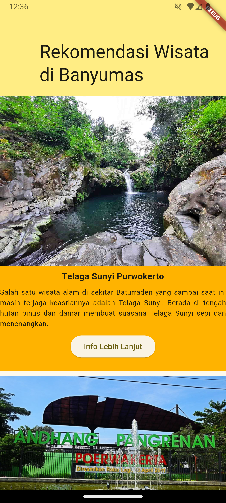

# Cover #
<div align="center">
LAPORAN PRAKTIKUM <br>
PEMROGRAMAN PERANGKAT BERGERAK <br>
<br>
MODUL V <br>
ANTARMUKA PENGGUNA LANJUTAN <br>


<br>

Disusun Oleh: <br>
Wahyu Isnantia Qodri Ghozali/2211104021 <br>
SE-06-01 <br>

<br>

Asisten Praktikum : <br>
Muhammad Faza Zulian Gesit Al Barru <br>
Aisyah Hasna Aulia <br>

<br>

Dosen Pengampu : <br>
Yudha Islami Sulistya, S.Kom., M.Cs <br>

<br>

PROGRAM STUDI S1 REKAYASSA PERANGKAT LUNAK <br>
FAKULTAS INFORMATIKA <br> 
TELKOM UNIVERSITY PURWOKERTO <br>

</div>

# Guided

## 1. ListView.builder <br>
Source Code:
```
import 'package:flutter/material.dart';

class ListViewBuilderExample extends StatelessWidget {
  const ListViewBuilderExample({super.key});

  @override
  Widget build(BuildContext context) {
    final List<int> colorCodes = <int>[600, 500, 100];
    final List<String> entries = <String>['A', 'B', 'C'];

    return Scaffold(
      appBar: AppBar(
        title: const Text("ListView.builder"),
        backgroundColor: Colors.amber,
      ),
      body: ListView.builder(
        padding: const EdgeInsets.all(8),
        itemCount: entries.length,
        itemBuilder: (BuildContext context, int index) {
          return Container(
            height: 50,
            color: Colors.amber[colorCodes[index]],
            child: Center(
              child: Text('Entry ${entries[index]}'),
            ),
          );
        },
      ),
    );
  }
}

```
Output Code: 

## 2. ListView.separated
Source Code:
```
import 'package:flutter/material.dart';

class ListViewSeparatedExample extends StatelessWidget {
  const ListViewSeparatedExample({super.key});

  @override
  Widget build(BuildContext context) {
    final List<int> colorCodes = <int>[600, 500, 100];
    final List<String> entries = <String>['A', 'B', 'C'];

    return Scaffold(
      appBar: AppBar(
        title: const Text("ListView.separated"),
        backgroundColor: Colors.amber,
      ),
      body: ListView.separated(
        padding: const EdgeInsets.all(8),
        itemCount: entries.length,
        itemBuilder: (BuildContext context, int index) {
          return Container(
            height: 50,
            color: Colors.amber[colorCodes[index]],
            child: Center(
              child: Text('Entry ${entries[index]}'),
            ),
          );
        }, separatorBuilder: (BuildContext context, int index) => const Divider(),
      ),
    );
  }
}

```
Output Code: 

## 3. Flexible and Expanded
Source Code:
```
import 'package:flutter/material.dart';
void main() {
  runApp(const FlexibleExpandedScreen(title: 'Flexible and Expanded Demo'));
}

class FlexibleExpandedScreen extends StatefulWidget {
  const FlexibleExpandedScreen({super.key, required this.title});
  final String title;

  @override
  State<FlexibleExpandedScreen> createState() => _FlexibleExpandedScreenState();
}

class _FlexibleExpandedScreenState extends State<FlexibleExpandedScreen> {
  @override
  Widget build(BuildContext context) {
    return Scaffold(
      appBar: AppBar(
        backgroundColor: Theme.of(context).colorScheme.inversePrimary,
        title: Text(widget.title),
      ),
      body: Center(
        child: Column(
          // mainAxisAlignment: MainAxisAlignment.center,
          children: <Widget>[
            Column(
              children: [
                const Text("Flexible"),
                // Flexible
                Row(
                  children: <Widget>[
                    Container(
                      width: 50,
                      height: 100,
                      color: Colors.red,
                    ),
                    Flexible(
                      child: Container(
                        height: 100,
                        color: Colors.green,
                        child: const Text(
                          "Flexible takes up the remaining space but can shrink if needed.",
                        ),
                      ),
                    ),
                    const Icon(Icons.sentiment_very_satisfied),
                  ],
                ),
                const SizedBox(height: 20),
                // Expanded
                const Text("Expanded"),
                Row(
                  children: <Widget>[
                    Container(
                      width: 50,
                      height: 100,
                      color: Colors.red,
                    ),
                    Expanded(
                      child: Container(
                        height: 100,
                        color: Colors.green,
                        child: const Text(
                          "Expanded forces the widget to take up all the remaining space.",
                        ),
                      ),
                    ),
                    const Icon(Icons.sentiment_very_satisfied),
                  ],
                ),
              ],
            ),
          ],
        ),
      ),
    );
  }
}
```

## 4. CustomScrollView
Source Code:
```
import 'package:flutter/material.dart';

class CustomScrollViewExample extends StatelessWidget {
  const CustomScrollViewExample({super.key});

  @override
  Widget build(BuildContext context) {
    return Scaffold(
      appBar: AppBar(
        title: const Text("Sliver"),
        backgroundColor: Colors.amber,
      ),
      body: CustomScrollView(
        slivers: <Widget>[
          // Sliver App Bar
          const SliverAppBar(
            pinned: true,
            expandedHeight: 50.0,
            flexibleSpace: FlexibleSpaceBar(
              title: Text('Sliver App Bar'),
            ),
          ),
          // Sliver Grid
          SliverGrid(
            gridDelegate: const SliverGridDelegateWithMaxCrossAxisExtent(
              maxCrossAxisExtent: 200.0,
              mainAxisSpacing: 10.0,
              crossAxisSpacing: 10.0,
              childAspectRatio: 4.0,
            ),
            delegate: SliverChildBuilderDelegate(
              (BuildContext context, int index) {
                return Container(
                  alignment: Alignment.center,
                  color: Colors.teal[100 * (index % 9)],
                  child: Text('Grid Item $index'),
                );
              },
              childCount: 6,
            ),
          ),
          // Sliver Fixed List
          SliverFixedExtentList(
            itemExtent: 50.0,
            delegate: SliverChildBuilderDelegate(
              (BuildContext context, int index) {
                return Container(
                  alignment: Alignment.center,
                  color: Colors.lightBlue[100 * (index % 9)],
                  child: Text('List Item $index'),
                );
              },
            ),
          ),
        ],
      ),
    );
  }
}
```
Output Code:


# Unguided
Source Code:
```
import 'package:flutter/material.dart';

void main() {
  runApp(const MyApp());
}

class MyApp extends StatelessWidget {
  const MyApp({super.key});

  @override
  Widget build(BuildContext context) {
    return MaterialApp(
      title: 'Rekomendasi Wisata',
      theme: ThemeData(
        colorScheme: ColorScheme.fromSeed(
          seedColor: const Color.fromARGB(255, 255, 237, 132),
        ),
        useMaterial3: true,
      ),
      home: const MyHomePage(title: 'Rekomendasi Wisata di Banyumas'),
    );
  }
}

class MyHomePage extends StatefulWidget {
  const MyHomePage({super.key, required this.title});
  final String title;

  @override
  State<MyHomePage> createState() => _MyHomePageState();
}

class _MyHomePageState extends State<MyHomePage> {
  final List<Map<String, String>> wisataList = [
    {
      'image':
          'img/1.TelagaSunyi.png',
      'title': 'Telaga Sunyi Purwokerto',
      'description':
          'Salah satu wisata alam di sekitar Baturraden yang sampai saat ini masih terjaga keasriannya adalah Telaga Sunyi. Berada di tengah hutan pinus dan damar membuat suasana Telaga Sunyi sepi dan menenangkan. ',
    },
    {
      'image':
          'img/2.TamanAndhang.png',
      'title': 'Taman Andhang Pangrenan Purwokerto',
      'description':
          'Merupakan objek wisata buatan berupa taman kota berbasis ruang terbuka hijau. Yang menariknya, kita dapat melakukan berbagai kegiatan wisata seperti wisata kuliner, wahana bermain anak-anak ataupun sekedar menikmati udara sejuk dan berelaksasi. Selain itu, tempat ini cocok buat kalian yang suka jalan santai atau jogging pagi ataupun sore hari.',
    },
    {
      'image':
          'img/3.TheVillagePurwokerto.png',
      'title': 'The Village Purwokerto',
      'description':
          'Sebuah wisata kota yang menghadirkan taman publik seluas 2.5 hektar di tengah Karisidenan Banyumas. Diresmikan pada tanggal 7 Februari 2018 dan mulai dibuka untuk umum mulai tanggal 9 Februari 2018. The Village juga menawarkan kesempatan untuk bertamasya dengan rancangan bangunannya yang memadukan karakteristik Barat dan Nusantara.',
    },
    {
      'image':
          'img/4.HutanPinusLimpakuwus.png',
      'title': 'Hutan Pinus Limpakuwus',
      'description':
          'Hutan yang berada di kawasan wisata Baturaden, yang berada di ketinggian 750 mdpl. Tempat ini cocok menjadi tempat wisata dari berbagai kalangan. Tidak hanya pemandangnnya saja yang indah, Hutan Pinus limpakuwus juga memiliki fasilitas penunjang seperti montain slide, playground, flyng fox, paint ball, dan ATV.',
    },
    {
      'image': 
          'img/5.NewSmallWorld.png',
      'title': 'New Small World',
      'description':
          'Obyek wisata yang memiliki berbagai miniatur landmark dan bangunan yang menjadi ikon berbagai negara di dunia. Setiap orang yang berkunjung ke sini akan dapat melihat seperti apa Menara Miring Pisa, Kolosium, Gedung Putih, Menara Eiffel, dan ikon dunia lainnya. Ada juga miniatur bangunan khas Indonesia.',
    },
  ];

  @override
  Widget build(BuildContext context) {
    return Scaffold(
      body: CustomScrollView(
        slivers: <Widget>[
          SliverAppBar(
            pinned: true,
            expandedHeight: 150.0,
            flexibleSpace: FlexibleSpaceBar(
                title: const Text('Rekomendasi Wisata di Banyumas'),
                background: Container(
                decoration: const BoxDecoration(
                  color: Color.fromARGB(255, 255, 237, 132),
                ),
              ),
            ),
          ),
          SliverList(
            delegate: SliverChildBuilderDelegate(
              (BuildContext context, int index) {
                return Container(
                  height: 500,
                  margin: const EdgeInsets.only(bottom: 10),
                  color: Colors.amber[600],
                  child: Column(
                    children: [
                        Image.asset(
                        wisataList[index]['image']!,
                        fit: BoxFit.fitWidth,
                      ),
                      const SizedBox(height: 8),
                      Text(
                        wisataList[index]['title']!,
                        style: const TextStyle(
                          fontSize: 16,
                          fontWeight: FontWeight.bold,
                        ),
                      ),
                      const SizedBox(height: 8),
                      Text(
                        wisataList[index]['description']!,
                        textAlign: TextAlign.justify,
                        style: const TextStyle(
                          fontSize: 13,
                        ),
                      ),
                      const SizedBox(height: 8),
                      ElevatedButton(
                        onPressed: () {
                          
                        },
                        child: const Text('Info Lebih Lanjut'),
                      ),
                    ],
                  ),
                );
              },
              childCount: wisataList.length,
            ),
          ),
        ],
      ),
    );
  }
}

```

Output Code:


Deskripsi:
Di halaman utama, terdapat daftar tempat wisata yang berisi gambar, judul, dan deskripsi singkat. Setiap item ditampilkan dalam bentuk kartu, lengkap dengan tombol "Info Lebih Lanjut" untuk melihat detail tambahan (meskipun fungsinya belum diimplementasikan). Daftar wisata ini ditampilkan dengan efek scroll yang menarik, di mana bagian header tetap terlihat meskipun pengguna menggulir daftar.
Di aplikasi ini, pada bagian home menggunakan widget Scaffold.
Untuk membuat daftar tempat wisata, digunakan widget CustomScrollView, SliverAppBar, dan SliverList.
Setiap item wisata menggunakan widget Container, Column, Image.asset, Text, dan ElevatedButton.