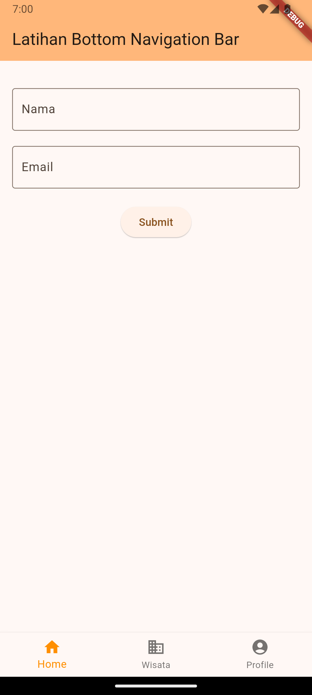

# Cover #
<div align="center">
LAPORAN PRAKTIKUM <br>
PEMROGRAMAN PERANGKAT BERGERAK <br>
<br>
MODUL VI <br>
INTERAKSI PENGGUNA <br>


<br>

Disusun Oleh: <br>
Wahyu Isnantia Qodri Ghozali/2211104021 <br>
SE-06-01 <br>

<br>

Asisten Praktikum : <br>
Muhammad Faza Zulian Gesit Al Barru <br>
Aisyah Hasna Aulia <br>

<br>

Dosen Pengampu : <br>
Yudha Islami Sulistya, S.Kom., M.Cs <br>

<br>

PROGRAM STUDI S1 REKAYASSA PERANGKAT LUNAK <br>
FAKULTAS INFORMATIKA <br> 
TELKOM UNIVERSITY PURWOKERTO <br>

</div>

# Guided
## 1. Packages
Secara singkat, dart package terdapat pada direktori yang didalamnya terdapat file pubspec.yaml. Contoh penggunaan packages adalah membuat request ke server menggunakan protokol http. Custom navigation/route handling menggunakan fluro, dsb. 

### Cara menambahkan packages:
1. Buka pub.dev 
2. Lalu cari package yg akan digunakan, disini kita akan menggunakan Google Font<br>
3. Buka file pubspec.yaml
4. Tambahkan ke file pubspec.yaml<br>
5. Save filenya, lalu tekan run pada pojok kanan atas
6. Tunggu hingga proses selesai
7. Import packagenya ke file dart

## 2. User Interaction
### 2.1 Stateful dan Stateles
Widget stateless tidak pernah berubah. Ikon, IconButton, dan Teks adalah contoh widget stateless. Sub kelas widget stateless StatelessWidget. Widget stateful bersifat dinamis misalnya, ia dapat mengubah tampilannya sebagai respons terhadap peristiwa yang dipicu oleh interaksi pengguna atau saat menerima data. Kotak centang, Radio, Slider, InkWell, Form, dan TextField adalah contoh widget stateful. Subkelas widget stateful StatefulWidget. 
### 2.2 Form
Source Code main.dart:
```
import 'package:flutter/material.dart';
// import 'package:googlepon/my_bottomnav.dart';
import 'package:googlepon/my_package.dart';
// import 'package:googlepon/my_tabbar.dart';

void main() {
  runApp(const MainApp());
}

class MainApp extends StatelessWidget {
  const MainApp({super.key});

  @override
  Widget build(BuildContext context) {
    return MaterialApp(
      home: MyPackage(),  
    );
  }
}
```
Source Code my_package.dart:
```
import 'package:flutter/material.dart';
import 'package:google_fonts/google_fonts.dart';

class MyPackage extends StatelessWidget {
  const MyPackage({super.key});

  @override
  Widget build(BuildContext context) {
    return Scaffold(
      appBar: AppBar(
        title: Text(
          'Belajar Package',
          style: GoogleFonts.lato(),
        ),
        backgroundColor: Colors.yellow,
      ),
      body: Padding(
        padding: const EdgeInsets.all(10),
        child: Column(
          crossAxisAlignment: CrossAxisAlignment.center,
          children: [
            Container(
              decoration: BoxDecoration(
                border: Border.all(color: Colors.blue),
                borderRadius: BorderRadius.circular(12),
              ),
              child: TextField(
                decoration: InputDecoration(
                  prefixIcon: Icon(Icons.person),
                  border: InputBorder.none,
                  hintText: 'Masukkan Nama',
                  contentPadding: EdgeInsets.all(16),
                ),
              ),
            ),
            SizedBox(height: 16),
            Container(
              decoration: BoxDecoration(
                border: Border.all(color: Colors.blue),
                borderRadius: BorderRadius.circular(12),
              ),
              child: TextField(
                decoration: InputDecoration(
                  prefixIcon: Icon(Icons.mail),
                  border: InputBorder.none,
                  hintText: 'Masukkan Email',
                  contentPadding: EdgeInsets.all(16),
                ),
              ),
            ),
          ],
        ),
      ),
    );
  }
}

```
Output Code:<br>

### 2.3 Menu
Source Code main.dart:
```
import 'package:flutter/material.dart';
// import 'package:googlepon/my_bottomnav.dart';
// import 'package:googlepon/my_package.dart';
import 'package:googlepon/my_tabbar.dart';

void main() {
  runApp(const MainApp());
}

class MainApp extends StatelessWidget {
  const MainApp({super.key});

  @override
  Widget build(BuildContext context) {
    return MaterialApp(
      home: MyTabbar(),  
    );
  }
}
```
Source Code my_tabbar.dart:
```
import 'package:flutter/material.dart';

class MyTabbar extends StatelessWidget {
  const MyTabbar({super.key});

  @override
  Widget build(BuildContext context) {
    return MaterialApp(
      title: 'My TabBar App',
      home: DefaultTabController(
        length: 4,
        child: Scaffold(
          appBar: AppBar(
            title: Text('Contoh Tab Bar'),
            bottom: TabBar(
              tabs: [
                Tab(
                  icon: Column(
                  mainAxisAlignment: MainAxisAlignment.center,
                  children: [
                    Icon(Icons.directions_car),
                    Text('Car'),
                  ],
                  ),
                ),
                Tab(
                  icon: Column(
                  mainAxisAlignment: MainAxisAlignment.center,
                  children: [
                    Icon(Icons.directions_bus),
                    Text('Bus'),
                  ],
                  ),
                ),
                Tab(
                  icon: Column(
                  mainAxisAlignment: MainAxisAlignment.center,
                  children: [
                    Icon(Icons.directions_transit),
                    Text('Transit'),
                  ],
                  ),
                ),
                Tab(
                  icon: Column(
                  mainAxisAlignment: MainAxisAlignment.center,
                  children: [
                    Icon(Icons.directions_boat),
                    Text('Boat'),
                  ],
                  ),
                ),
              ],
            ),
          ),
          body: TabBarView(
            children: [
              Icon(Icons.directions_car),
              Icon(Icons.directions_bus),
              Icon(Icons.directions_transit),
              Icon(Icons.directions_boat),
            ],
          ),
        ),
      ),
    );
  }
}
```
Output Code:<br>

### 2.4 Buttons
Source Code main.dart:
```
import 'package:flutter/material.dart';
import 'package:googlepon/my_bottomnav.dart';
// import 'package:googlepon/my_package.dart';
// import 'package:googlepon/my_tabbar.dart';

void main() {
  runApp(const MainApp());
}

class MainApp extends StatelessWidget {
  const MainApp({super.key});

  @override
  Widget build(BuildContext context) {
    return MaterialApp(
      home: MyBottomNavBar(),  
    );
  }
}
```
Source Code my_bottomnav.dart:
```
import 'package:flutter/material.dart';

class MyBottomNavBar extends StatefulWidget {
  const MyBottomNavBar({super.key});

  @override
  State<MyBottomNavBar> createState() => _MyBottomNavBarState();
}

class _MyBottomNavBarState extends State<MyBottomNavBar> {
  int _selectedIndex = 0;
  String? selectedValue;

  static const TextStyle optionStyle = TextStyle(
    fontSize: 30,
    fontWeight: FontWeight.bold,
  );

  static const List<Widget> _widgetOptions = <Widget>[
    Text(
      'Index 0: Home',
      style: optionStyle,
    ),
    Text(
      'Index 1: Business',
      style: optionStyle,
    ),
    Text(
      'Index 2: School',
      style: optionStyle,
    ),
  ];

  void _onItemTapped(int index) {
    setState(() {
      _selectedIndex = index;
    });
  }

  @override
  Widget build(BuildContext context) {
    return Scaffold(
      appBar: AppBar(
        title: const Text('Bottom Navigation Bar'),
      ),
      body: Center(
        child: Column(
          mainAxisAlignment: MainAxisAlignment.center,
          children: <Widget>[
            _widgetOptions.elementAt(_selectedIndex),
            ElevatedButton(
              onPressed: () {
                // Aksi yang akan dilakukan ketika tombol ditekan
                print('Tombol Elevated ditekan!');
              },
              child: Text('Klik Saya'),
            ),
            TextButton(
              onPressed: () {},
              style: TextButton.styleFrom(
                foregroundColor: Colors.blue, backgroundColor: Colors.grey[200], // Warna latar belakang
              ),
              child: Text('Simpan'),
            ),
            DropdownButton<String>(
              value: selectedValue,
              hint: Text('Pilih Opsi'),
              onChanged: (String? newValue) {
                setState(() {
                  selectedValue = newValue;
                });
              },
              items: <String>['Opsi 1', 'Opsi 2', 'Opsi 3']
                  .map<DropdownMenuItem<String>>((String value) {
                return DropdownMenuItem<String>(
                  value: value,
                  child: Text(value),
                );
              }).toList(),
            ),
          ],
        ),
      ),
      bottomNavigationBar: BottomNavigationBar(
        items: const <BottomNavigationBarItem>[
          BottomNavigationBarItem(
            icon: Icon(Icons.home),
            label: 'Home',
          ),
          BottomNavigationBarItem(
            icon: Icon(Icons.business),
            label: 'Business',
          ),
          BottomNavigationBarItem(
            icon: Icon(Icons.school),
            label: 'School',
          ),
        ],
        currentIndex: _selectedIndex,
        selectedItemColor: Colors.amber[800],
        onTap: _onItemTapped,
      ),
    );
  }
}
```
Output Code:<br>


# Unguided
## Source Code:
```
import 'package:flutter/material.dart';

void main() {
  runApp(const MyApp());
}

class MyApp extends StatelessWidget {
  const MyApp({super.key});

  @override
  Widget build(BuildContext context) {
    return MaterialApp(
      title: 'Praktikum 6',
      theme: ThemeData(
        colorScheme: ColorScheme.fromSeed(seedColor: const Color.fromARGB(255, 255, 143, 0)),
        useMaterial3: true,
      ),
      home: const MyHomePage(title: 'Latihan Bottom Navigation Bar'),
    );
  }
}

class MyHomePage extends StatefulWidget {
  const MyHomePage({super.key, required this.title});

  final String title;

  @override
  State<MyHomePage> createState() => _MyHomePageState();
}

class _MyHomePageState extends State<MyHomePage> {

  int _selectedIndex = 0;
  final PageController _pageController = PageController();

  static const TextStyle optionStyle = TextStyle(fontSize: 20);

  static final List<Widget> _widgetOptions = <Widget>[
    Padding(
      padding: const EdgeInsets.all(16.0),
      child: Column(
        crossAxisAlignment: CrossAxisAlignment.center,
        children: [
          const SizedBox(height: 20),
          TextField(
            decoration: InputDecoration(
              border: OutlineInputBorder(),
              labelText: 'Nama',
            ),
          ),
          const SizedBox(height: 20),
          TextField(
            decoration: InputDecoration(
              border: OutlineInputBorder(),
              labelText: 'Email',
            ),
            keyboardType: TextInputType.emailAddress,
          ),
          const SizedBox(height: 20),
          ElevatedButton(
            onPressed: () {},
            child: const Text('Submit'),
          ),
        ],
      ),
    ),
    Center(
      child: Text(
        'Ini Halaman Wisata',
        style: optionStyle,
      ),
    ),
    Center(
      child: Text(
        'Ini Halaman Profile',
        style: optionStyle,
      ),
    ),
  ];

  void _onItemTapped(int index) {
    setState(() {
      _selectedIndex = index;
    });
    _pageController.animateToPage(
      index,
      duration: const Duration(milliseconds: 300),
      curve: Curves.easeInOut,
    );
  }

  @override
  void dispose() {
    _pageController.dispose();
    super.dispose();
  }

  @override
  Widget build(BuildContext context) {
    return Scaffold(
      appBar: AppBar(
        backgroundColor: Theme.of(context).colorScheme.inversePrimary,
        title: Text(widget.title),
      ),
      body: PageView(
        controller: _pageController,
        onPageChanged: (index) {
          setState(() {
            _selectedIndex = index;
          });
        },
        children: _widgetOptions,
      ),
      bottomNavigationBar: BottomNavigationBar(
        items: const <BottomNavigationBarItem>[
          BottomNavigationBarItem(
            icon: Icon(Icons.home),
            label: "Home",
          ),
          BottomNavigationBarItem(
            icon: Icon(Icons.business),
            label: "Wisata",
          ),
          BottomNavigationBarItem(
            icon: Icon(Icons.account_circle),
            label: "Profile",
          ),
        ],
        currentIndex: _selectedIndex,
        selectedItemColor: const Color.fromARGB(255, 255, 143, 0),
        onTap: _onItemTapped,
      ),
    );
  }
}

```
## Output Code:


## Penjelasan:
Kode di atas akan menampilkan tampilan aplikasi dengan tiga halaman utama: "Home", "Wisata", dan "Profile". Dengan menggunakan widget PageView dan PageController, perpindahan antar halaman ini akan diiringi animasi transisi yang mulus. Di halaman "Home", terdapat form di bagian atas untuk mengisi nama dan email, serta tombol submit tanpa fungsi khusus. BottomNavigationBar digunakan untuk navigasi antar halaman, dan setiap kali ikon ditekan, aplikasi akan mengubah halaman menggunakan animasi sesuai dengan pengaturan pada PageController.