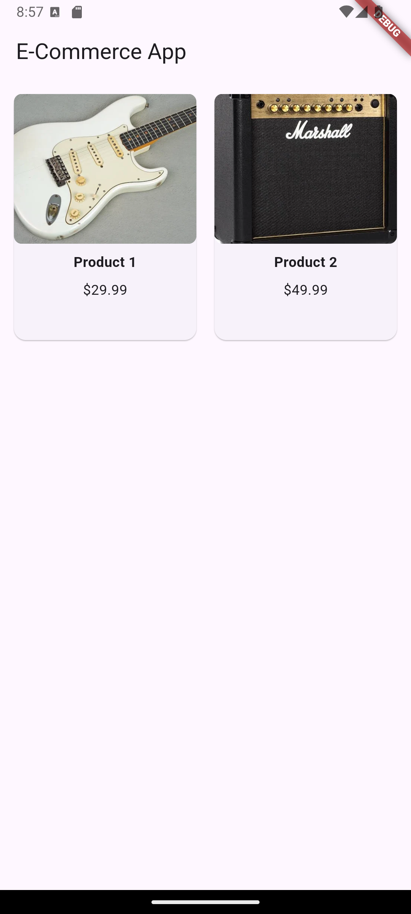
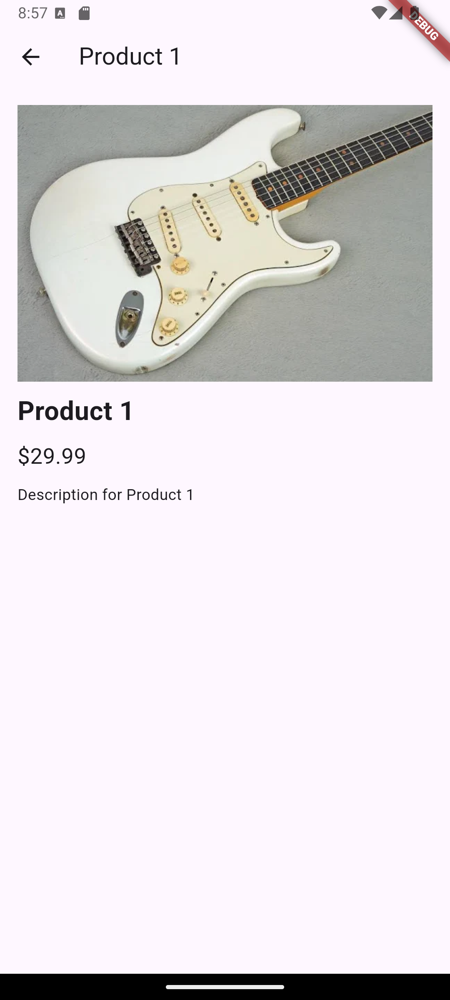

# Cover #
<div align="center">
LAPORAN PRAKTIKUM <br>
PEMROGRAMAN PERANGKAT BERGERAK <br>
<br>
MODUL VII <br>
Navigasi Notifikasi <br>


<br>

Disusun Oleh: <br>
Wahyu Isnantia Qodri Ghozali/2211104021 <br>
SE-06-01 <br>

<br>

Asisten Praktikum : <br>
Muhammad Faza Zulian Gesit Al Barru <br>
Aisyah Hasna Aulia <br>

<br>

Dosen Pengampu : <br>
Yudha Islami Sulistya, S.Kom., M.Cs <br>

<br>

PROGRAM STUDI S1 REKAYASSA PERANGKAT LUNAK <br>
FAKULTAS INFORMATIKA <br> 
TELKOM UNIVERSITY PURWOKERTO <br>

</div>

# Guided
## 1. Model
Pada umumnya, hampir seluruh aplikasi yang dibuat akan bekerja dengan data. Data dalam sebuah aplikasi memiliki sangat banyak bentuk, tergantung dari aplikasi yang dibuat. Setiap data yang diterima atau dikirimkan akan lebih baik apabila memiliki standar yang sama. Hampir mustahil melakukan peneliharaan project yang kompleks tanpa model. 

Source Code main.dart:
```
import 'package:flutter/material.dart';
import 'package:praktikum7/pages/mypage.dart';

void main() {
  runApp(const MyApp());
}

class MyApp extends StatelessWidget {
  const MyApp({super.key});

  
  
  @override
  Widget build(BuildContext context) {
    return MaterialApp(
      title: 'Flutter Demo',
      theme: ThemeData(
        colorScheme: ColorScheme.fromSeed(seedColor: Colors.deepPurple),
        useMaterial3: true,
      ),
      home: MyPage(),
    );
  }
}
```

Source Code models/product.dart:
```
class Product {
  final int id;
  final String nama;
  final double harga;
  final String imageurl;
  final String deskripsi;

  Product({
    required this.id,
    required this.nama,
    required this.harga,
    required this.imageurl,
    required this.deskripsi,
  });

  // Method mengkonversi JSON ke object product
  factory Product.fromJson(Map<String, dynamic> json) {
    return Product(
      id: json["id"],
      nama: json["nama"],
      harga: json["harga"].toDouble(),
      imageurl: json["imageurl"],
      deskripsi: json["deskripsi"],
    );
  }

  // Method untuk mengkonversi object ke JSON
  Map<String, dynamic> toJson() {
    return {
      'id' : id,
      'nama' : nama,
      'harga' : id,
      'imageurl' : imageurl,
      'deskripsi' : deskripsi,
    };
    
  }
}
```
## 2. Navigation

Source Code pages/mypage.dart:
```
import 'package:flutter/material.dart';
import 'package:praktikum7/models/product.dart';
import 'package:praktikum7/pages/detail.dart';

class MyPage extends StatelessWidget {
  MyPage({super.key});
  
  final List<Product> products = [
    Product(
      id: 1, 
      nama: "Mouse", 
      harga: 300000.00, 
      imageurl: "https://resource.logitechg.com/w_386,ar_1.0,c_limit,f_auto,q_auto,dpr_2.0/d_transparent.gif/content/dam/gaming/en/products/g502x-plus/gallery/g502x-plus-gallery-1-black.png?v=1", 
      deskripsi: "Mouse Gaming!"
    ),
    Product(
      id: 2, 
      nama: "Keyboard", 
      harga: 350000.00, 
      imageurl: "https://resource.logitech.com/w_1600,c_limit,q_auto,f_auto,dpr_1.0/d_transparent.gif/content/dam/logitech/en/products/keyboards/mx-mechanical/gallery/mx-mechanical-keyboard-top-view-graphite-us.png?v=1&quot", 
      deskripsi: "Keyboard Logitech!"
    ),
    Product(
      id: 3, 
      nama: "Headphone", 
      harga: 150000.00, 
      imageurl: "https://m.media-amazon.com/images/I/61CGHv6kmWL.AC_UF894,1000_QL80.jpg", 
      deskripsi: "With Mic!",
    ),
  ];

  @override
  Widget build(BuildContext context) {
    return Scaffold(
      appBar: AppBar(
        title: const Text("Class Model"),
        centerTitle: true,
        backgroundColor: Colors.blue,
      ),
      body: ListView.builder(
        itemCount: products.length,
        itemBuilder: (context, index) {
          final product = products[index];
          return ListTile(
            leading: Image.network(
              product.imageurl,
              width: 50,
              height: 50,
              fit: BoxFit.cover,
            ),
            title: Text(product.nama),
            subtitle: Text(product.deskripsi),
            trailing: Text("Rp ${product.harga}"),
            onTap: () {
              Navigator.push(
                context, 
                MaterialPageRoute(builder: (_) => DetailProduct(),
                ),
              );
            },
          );
        },
      ),
    );
  }
}
```

Source Code pages/detail.dart:
```
import 'package:flutter/material.dart';

class DetailProduct extends StatelessWidget {
  const DetailProduct({super.key});

  @override
  Widget build(BuildContext context) {
    return Scaffold(
      appBar: AppBar(
        title: Text("Detail Produk"),
        centerTitle: true,
        backgroundColor: Colors.blue,
      ),
      body: Center(
        child: Text("Ini adalah produk detail"),
      ),
    );
  }
}
```
Output Code:


## 3. Notification

Source Code 

# Unguided