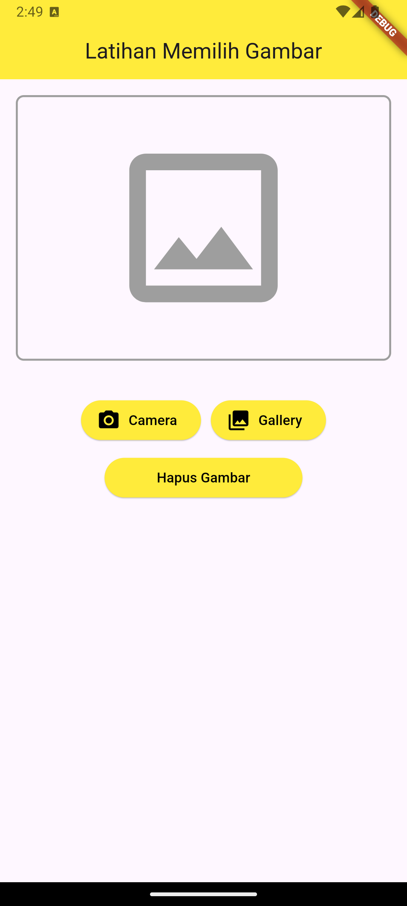

# Cover #
<div align="center">
TUGAS PENDAHULUAN<br>
PEMROGRAMAN PERANGKAT BERGERAK <br>
<br>
MODUL IX <br>
API PERANGKAT KERAS <br>


<br>

Disusun Oleh: <br>
Wahyu Isnantia Qodri Ghozali/2211104021 <br>
SE-06-01 <br>

<br>

Asisten Praktikum : <br>
Muhammad Faza Zulian Gesit Al Barru <br>
Aisyah Hasna Aulia <br>

<br>

Dosen Pengampu : <br>
Yudha Islami Sulistya, S.Kom., M.Cs <br>

<br>

PROGRAM STUDI S1 REKAYASSA PERANGKAT LUNAK <br>
FAKULTAS INFORMATIKA <br> 
TELKOM UNIVERSITY PURWOKERTO <br>

</div>

# Soal Nomor 1
a. Buatlah satu project baru, yang mana di dalamnya memuat container berisi 
Icons.image_outlined, button camera, button gallery dan button hapus gambar. 
Button tidak harus berfungsi.

Source Code:
```
import 'package:flutter/material.dart';

void main() {
  runApp(MyApp());
}

class MyApp extends StatelessWidget {
  @override
  Widget build(BuildContext context) {
    return MaterialApp(
      home: Scaffold(
        appBar: AppBar(
          title: Text(
            'Latihan Memilih Gambar',
            textAlign: TextAlign.center,
          ),
          centerTitle: true,
          backgroundColor: Colors.yellow,
          elevation: 0,
        ),
        body: Column(
          children: [
            Container(
              width: double.infinity,
              height: 300,
              padding: EdgeInsets.all(16),
              child: AspectRatio(
                aspectRatio: 1,
                child: Container(
                  decoration: BoxDecoration(
                    border: Border.all(color: Colors.grey, width: 2),
                    borderRadius: BorderRadius.circular(8),
                  ),
                  child: Center(
                    child: FittedBox(
                      child: Icon(Icons.image_outlined, size: 200, color: Colors.grey),
                    ),
                  ),
                ),
              ),
            ),
            SizedBox(height: 20),
            Row(
              mainAxisAlignment: MainAxisAlignment.center,
              children: [
                ElevatedButton.icon(
                  onPressed: () {},
                  style: ElevatedButton.styleFrom(
                    backgroundColor: Colors.yellow,
                  ),
                  icon: Icon(Icons.camera_alt, color: Colors.black),
                  label: Text('Camera', style: TextStyle(color: Colors.black)),
                ),
                SizedBox(width: 10),
                ElevatedButton.icon(
                  onPressed: () {},
                  style: ElevatedButton.styleFrom(
                    backgroundColor: Colors.yellow,
                  ),
                  icon: Icon(Icons.photo_library, color: Colors.black),
                  label: Text('Gallery', style: TextStyle(color: Colors.black)),
                ),
              ],
            ),
            SizedBox(height: 10),
            ElevatedButton(
              onPressed: () {},
              style: ElevatedButton.styleFrom(
                backgroundColor: Colors.yellow,
                fixedSize: Size(200, 40),
              ),
              child: Text('Hapus Gambar', style: TextStyle(color: Colors.black)),
            ),
          ],
        ),
      ),
    );
  }
}
```

Screenshot Output:<br>


Deskripsi Program:
Kode di atas menggunakan MaterialApp dan Scaffold untuk membangun aplikasi dengan AppBar yang memiliki judul di tengah. Di dalam body, terdapat Container untuk menampilkan ikon gambar dan tombol-tombol (Camera, Gallery, Hapus Gambar) di luar container. Tombol menggunakan ElevatedButton.icon untuk menampilkan ikon dan teks.