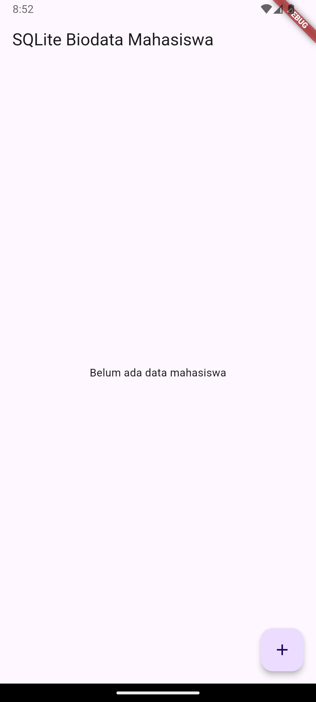
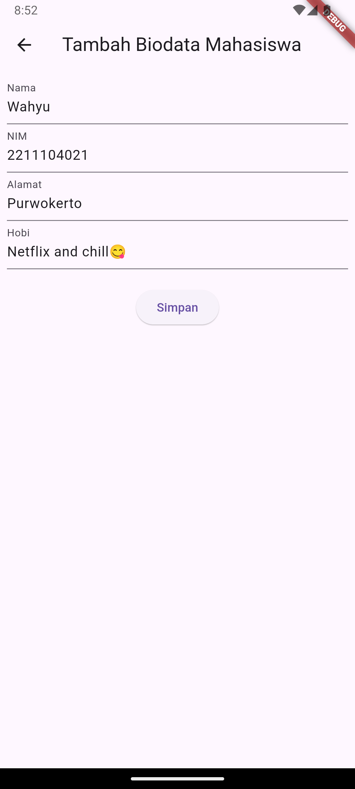
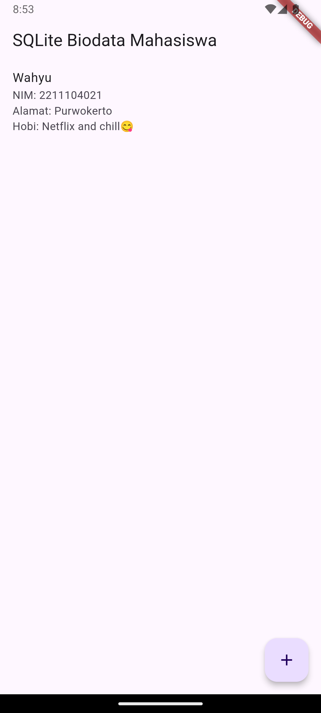

# Cover #
<div align="center">
LAPORAN PRAKTIKUM <br>
PEMROGRAMAN PERANGKAT BERGERAK <br>
<br>
MODUL X <br>
Data Storage Bagian 1 <br>


<br>

Disusun Oleh: <br>
Wahyu Isnantia Qodri Ghozali/2211104021 <br>
SE-06-01 <br>

<br>

Asisten Praktikum : <br>
Muhammad Faza Zulian Gesit Al Barru <br>
Aisyah Hasna Aulia <br>

<br>

Dosen Pengampu : <br>
Yudha Islami Sulistya, S.Kom., M.Cs <br>

<br>

PROGRAM STUDI S1 REKAYASSA PERANGKAT LUNAK <br>
FAKULTAS INFORMATIKA <br> 
TELKOM UNIVERSITY PURWOKERTO <br>

</div>

# Guided

## 1. Pengenalan SQLite
SQLite adalah database relasional yang merupakan penyimpanan data secara offline untuk sebuah mobile app (pada local storage, lebih tepatnya pada cache memory aplikasi). SQLite memiliki CRUD (create, read, update dan delete). Empat operasi tersebut penting dalam sebuah penyimpanan. Untuk struktur database pada SQLite, sama seperti SQL pada umumnya, variabel dan tipe data yang dimiliki tidak jauh berbeda dengan SQL.

## 2. SQL Helper Dasar
Dalam Flutter, SQL Helper biasanya merujuk pada penggunaan paket seperti sqflite untuk mengelola database SQLite. SQL Helper merupakan class untuk membuat beberapa method yang berkaitan dengan perubahan data. sqflite adalah plugin Flutter yang memungkinkan untuk melakukan operasi CRUD (Create, Read, Update, Delete) pada database SQLite.

Berikut adalah langkah-langkah dasar untuk menggunakan sqflite sebagai SQL Helper di Flutter :
### 1. Tambahkan plugin sqflite dan path ke file pubspec.yaml.
### 2. Buat class baru bernama DatabseHelper untk mengelola database dan import package sqflite dan path di file db_helper.dart.
```
import 'package:sqflite/sqflite.dart';
import 'package:path/path.dart';
class DatabaseHelper {
static final DatabaseHelper _instance = DatabaseHelper._internal();
static Database? _database;
}
```
### 3. Buat factory constructor untuk mengembalikan instance singleton dan private singleton.
```
import 'package:sqflite/sqflite.dart';
import 'package:path/path.dart';
// kelas DatabaseHelper untuk mengelola database
class DatabaseHelper {
static final DatabaseHelper _instance = DatabaseHelper._internal();
static Database? _database;
factory DatabaseHelper() {
return _instance;
}
// Private constructor
DatabaseHelper._internal();
}
```
### 4. Buat Getter untuk database.
```
Future<Database> get database async {
if (_database != null) return _database!;
{
_database = await _initDatabase();
return _database!;
}
}
```
### 5. Inisialisasi database dengan nama database yang kita mau.
```
Future<Database> _initDatabase() async {
// mendapatkan path untuk database
String path = join(await getDatabasesPath(), 'my_prakdatabase.db');
// membuka database
return await openDatabase(
path,
version: 1,
onCreate: _onCreate,
);
}
```
### 6. Kemudian buat tabel untuk database-nya dengan record atau value id, title, dan description.
```
Future<void> _onCreate(Database db, int version) async {
await db.execute('''
CREATE TABLE my_table(
id INTEGER PRIMARY KEY AUTOINCREMENT NOT NULL,
title TEXT,
description TEXT,
createdAt TIMESTAMP NOT NULL DEFAULT CURRENT_TIMESTAMP)
''');
}
```
### 7. Buat metode untuk memasukkan data ke dalam tabel.
```
Future<int> insert(Map<String, dynamic> row) async {
Database db = await database;
return await db.insert('my_table', row);
}
```
### 8. Lalu, metode untuk mengambil semua data dari tabel.
```
Future<List<Map<String, dynamic>>> queryAllRows() async {
Database db = await database;
return await db.query('my_table');
}
```
### 9.  Buat metode untuk memperbarui data dalam tabel.
```
Future<int> update(Map<String, dynamic> row) async {
Database db = await database;
int id = row['id'];
return await db.update('my_table', row, where: 'id = ?', whereArgs: [id]);
}
```
### 10. Diakhiri dengan metode untuk menghapus data dari tabel.
```
Future<int> delete(int id) async {
Database db = await database;
return await db.delete('my_table', where: 'id = ?', whereArgs: [id]);
}
```

## a. Read
Di package sqflite, kita akan menggunakan query() untuk membaca data yang ada pada database. Sqflite di Flutter kita dapat membuat query menggunakan bermacam-macam perintah, seperti where, groupBy, orderBy, dan having. Selain itu, kita juga bisa membaca satu data atau banyak data sekaligus. Berikut barisan kode read pada sqflite :

### Membaca semua data
```
Future<List<Map<String, dynamic>>> queryAllRows() async {
Database db = await database;
return await db.query('my_table');
}
```
### Membaca satu data melalui id
```
Future<List<Map<String, dynamic>>> getItem(int id) async {
Database db = await database;
Return await db.query('my_table', row, where: "id = ?", whereArgs: [id], limit: 1);
}
```

# Unguided

## Source Code `main.dart`:
```
import 'package:flutter/material.dart';
import 'package:praktikum10/view/home_page.dart';

void main() {
  runApp(const MyApp());
}

class MyApp extends StatelessWidget {
  const MyApp({super.key});

  @override
  Widget build(BuildContext context) {
    return MaterialApp(
      title: 'SQLite Biodata Mahasiswa',
      theme: ThemeData(
        primarySwatch: Colors.blue,
        useMaterial3: true,
      ),
      home: const HomePage(),
    );
  }
}

```
## Source Code `helper/db_helper.dart`:
```
import 'package:sqflite/sqflite.dart';
import 'package:path/path.dart';

class DatabaseHelper {
  static final DatabaseHelper _instance = DatabaseHelper._internal();
  static Database? _database;

  factory DatabaseHelper() => _instance;

  DatabaseHelper._internal();

  Future<Database> get database async {
    if (_database == null) {
      _database = await _initDatabase();
    }
    return _database!;
  }

  Future<Database> _initDatabase() async {
    String path = join(await getDatabasesPath(), 'biodata_mahasiswa.db');
    return await openDatabase(
      path,
      version: 1,
      onCreate: (db, version) async {
        await db.execute('''
          CREATE TABLE mahasiswa(
            id INTEGER PRIMARY KEY AUTOINCREMENT NOT NULL,
            nama TEXT,
            nim TEXT,
            alamat TEXT,
            hobi TEXT
          )
        ''');
      },
    );
  }

  Future<int> insert(Map<String, dynamic> data) async {
    Database db = await database;
    return await db.insert('mahasiswa', data);
  }

  Future<List<Map<String, dynamic>>> queryAll() async {
    Database db = await database;
    return await db.query('mahasiswa');
  }
}

```
## Source Code `view/home_page.dart`:
```
import 'package:flutter/material.dart';
import 'package:praktikum10/helper/db_helper.dart';
import 'package:praktikum10/view/input_page.dart';

class HomePage extends StatefulWidget {
  const HomePage({super.key});

  @override
  State<HomePage> createState() => _HomePageState();
}

class _HomePageState extends State<HomePage> {
  final DatabaseHelper dbHelper = DatabaseHelper();
  List<Map<String, dynamic>> mahasiswaList = [];

  @override
  void initState() {
    super.initState();
    _refreshData();
  }

  void _refreshData() async {
    final data = await dbHelper.queryAll();
    setState(() {
      mahasiswaList = data;
    });
  }

  @override
  Widget build(BuildContext context) {
    return Scaffold(
      appBar: AppBar(
        title: const Text("SQLite Biodata Mahasiswa", textAlign: TextAlign.center),
      ),
      body: mahasiswaList.isEmpty
          ? const Center(child: Text("Belum ada data mahasiswa"))
          : ListView.builder(
              itemCount: mahasiswaList.length,
              itemBuilder: (context, index) {
                final item = mahasiswaList[index];
                return ListTile(
                  title: Text(item['nama']),
                  subtitle: Text("NIM: ${item['nim']}\nAlamat: ${item['alamat']}\nHobi: ${item['hobi']}"),
                );
              },
            ),
      floatingActionButton: FloatingActionButton(
        onPressed: () {
          Navigator.push(
            context,
            MaterialPageRoute(
              builder: (context) => InputPage(onSave: _refreshData),
            ),
          );
        },
        child: const Icon(Icons.add),
      ),
    );
  }
}

```
## Source Code `view/input_page.dart`:
```
import 'package:flutter/material.dart';
import 'package:praktikum10/helper/db_helper.dart';

class InputPage extends StatefulWidget {
  final VoidCallback onSave;
  const InputPage({super.key, required this.onSave});

  @override
  State<InputPage> createState() => _InputPageState();
}

class _InputPageState extends State<InputPage> {
  final TextEditingController _namaController = TextEditingController();
  final TextEditingController _nimController = TextEditingController();
  final TextEditingController _alamatController = TextEditingController();
  final TextEditingController _hobiController = TextEditingController();
  final DatabaseHelper dbHelper = DatabaseHelper();

  void _saveData() async {
    await dbHelper.insert({
      'nama': _namaController.text,
      'nim': _nimController.text,
      'alamat': _alamatController.text,
      'hobi': _hobiController.text,
    });
    widget.onSave();
    Navigator.pop(context);
  }

  @override
  Widget build(BuildContext context) {
    return Scaffold(
      appBar: AppBar(
        title: const Text("Tambah Biodata Mahasiswa"),
      ),
      body: Padding(
        padding: const EdgeInsets.all(8.0),
        child: Column(
          children: [
            TextField(
              controller: _namaController,
              decoration: const InputDecoration(labelText: "Nama"),
            ),
            TextField(
              controller: _nimController,
              decoration: const InputDecoration(labelText: "NIM"),
            ),
            TextField(
              controller: _alamatController,
              decoration: const InputDecoration(labelText: "Alamat"),
            ),
            TextField(
              controller: _hobiController,
              decoration: const InputDecoration(labelText: "Hobi"),
            ),
            const SizedBox(height: 20),
            ElevatedButton(
              onPressed: _saveData,
              child: const Text("Simpan"),
            ),
          ],
        ),
      ),
    );
  }
}

```

## Output:




## Penjelasan:
Di file `main.dart` akan memulai aplikasi dengan menjalankan widget `MyApp` sebagai root. `MyApp` mengatur tema aplikasi dan menentukan halaman awal, yaitu `HomePage`.

Di file `helper/db_helper.dart` akan menyediakan kelas `DatabaseHelper` untuk mengatur semua operasi terkait database SQLite, seperti membuat database, menambahkan data, mengambil data, dan lain-lain. Metode seperti `insert` digunakan untuk menambahkan data ke tabel, sedangkan `queryAll` digunakan untuk mengambil semua data dari tabel.

Di file `view/home_page.dart` akan menampilkan daftar biodata mahasiswa yang disimpan di database. Komponen ini memuat data menggunakan `DatabaseHelper`, menampilkan data dalam bentuk daftar dengan widget `ListView.builder`, dan memiliki tombol `FloatingActionButton` untuk mengarahkan pengguna ke halaman input.

Di file `view/input_page.dart` akan menyediakan form input dengan empat kolom: Nama, NIM, Alamat, dan Hobi. Setelah data diisi dan tombol "Simpan" ditekan, data tersebut akan disimpan ke database melalui `DatabaseHelper` menggunakan metode `insert`, lalu pengguna diarahkan kembali ke halaman utama untuk melihat daftar yang telah diperbarui.
