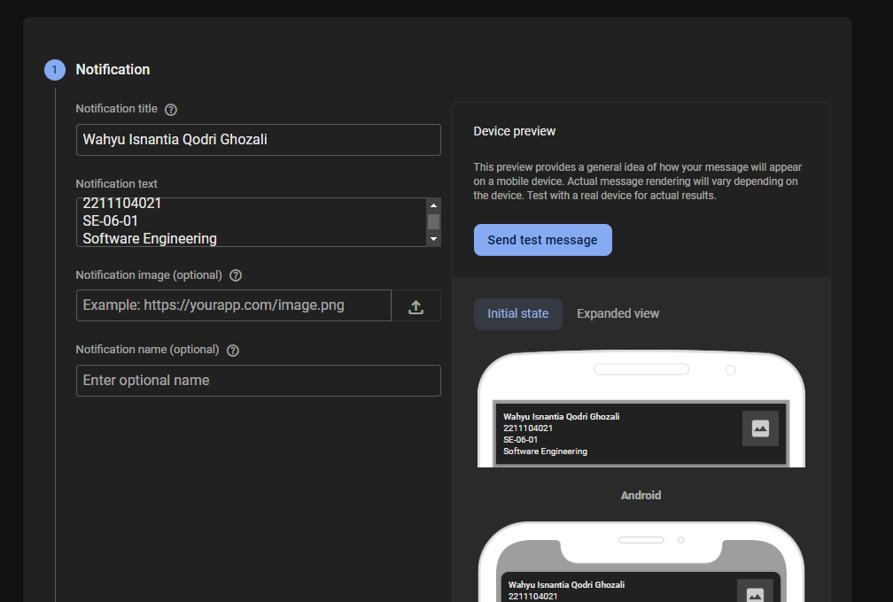
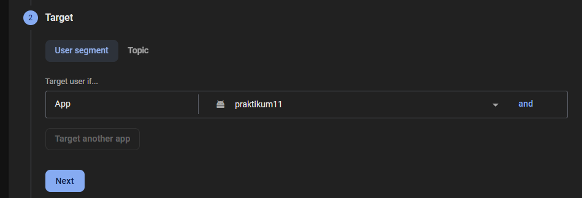
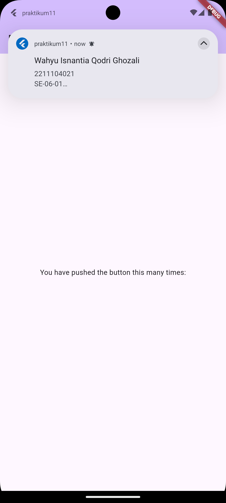
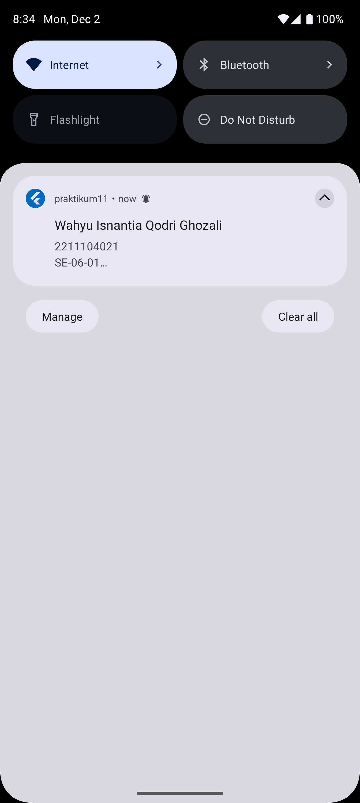

 Cover #
<div align="center">
LAPORAN PRAKTIKUM <br>
PEMROGRAMAN PERANGKAT BERGERAK <br>
<br>
MODUL XI <br>
Data Storage Bagian 2 <br>


<br>

Disusun Oleh: <br>
Wahyu Isnantia Qodri Ghozali/2211104021 <br>
SE-06-01 <br>

<br>

Asisten Praktikum : <br>
Muhammad Faza Zulian Gesit Al Barru <br>
Aisyah Hasna Aulia <br>

<br>

Dosen Pengampu : <br>
Yudha Islami Sulistya, S.Kom., M.Cs <br>

<br>

PROGRAM STUDI S1 REKAYASSA PERANGKAT LUNAK <br>
FAKULTAS INFORMATIKA <br> 
TELKOM UNIVERSITY PURWOKERTO <br>

</div>

# Guided

## Configurasi firebaase
1. Login dan buat projek baru di firebase
https://console.firebase.google.com/ dan buat projek
2. Masukan package name dari `./android/app/build.gradle.`
Catatan: App nickname and SHA-1 signing certificate key itu opsional
3. Download `google-services.json` lalu taruh di `./android/app/`
4. Tambahkan plugin dan sdk sesuai perintah pada ./android/build.gradle dan ./android/app/build.gradle lalu lakukan sync dengan mengetik “flutter pub get” pada terminal.
5. Ketik di terminal `flutter pub add firebase_core firebase_messaging flutter_local_notifications`
6. Ubah compile sdk agar menggunakan versi 33 dan min sdk pada versi 21 yang terletak pada file `./android/app/build.gradle`
   
   ```
   minSdkVersion 21
   targetSdkVersion 33
   ```

## Membuat Notifikasi Handler
### Source Code `main.dart`:
```
import 'package:flutter/material.dart';
import 'package:firebase_core/firebase_core.dart';
import 'package:firebase_messaging/firebase_messaging.dart';
import 'package:flutter_local_notifications/flutter_local_notifications.dart';

String? token;
Future<void> _firebaseMessagingBackgroundHandler(RemoteMessage message) async {
  await Firebase.initializeApp();
  print('Handling a background message: ${message.messageId}');
}

const AndroidNotificationChannel channel = AndroidNotificationChannel(
  'high_importance_channel', // ID Channel
  'High Importance Notifications', // Nama Channel
  description:
      'This channel is used for important notifications.', // Deskripsi Channel
  importance: Importance.high, // Prioritas
);

void main() async {
  WidgetsFlutterBinding.ensureInitialized();
  await Firebase.initializeApp();
  FirebaseMessaging.onBackgroundMessage(_firebaseMessagingBackgroundHandler);
  await FlutterLocalNotificationsPlugin()
      .resolvePlatformSpecificImplementation<
          AndroidFlutterLocalNotificationsPlugin>()
      ?.createNotificationChannel(channel);
  await FirebaseMessaging.instance.setForegroundNotificationPresentationOptions(
    alert: true,
    badge: true,
    sound: true,
  );

  runApp(const MyApp());
}

class MyApp extends StatelessWidget {
  const MyApp({super.key});

  @override
  Widget build(BuildContext context) {
    return MaterialApp(
      title: 'Flutter Demo',
      theme: ThemeData(
        colorScheme: ColorScheme.fromSeed(seedColor: Colors.deepPurple),
        useMaterial3: true,
      ),
      home: const MyHomePage(title: 'Flutter Demo Home Page'),
    );
  }
}

class MyHomePage extends StatefulWidget {
  const MyHomePage({super.key, required this.title});

  final String title;

  @override
  State<MyHomePage> createState() => _MyHomePageState();
}

class _MyHomePageState extends State<MyHomePage> {
  @override
  void initState() {
    super.initState();
    // Membuat pengaturan inisialisasi notifikasi untuk Android
    var initializationSettingsAndroid =
        const AndroidInitializationSettings('@mipmap/ic_launcher');
    var initializationSettings =
        InitializationSettings(android: initializationSettingsAndroid);
    FlutterLocalNotificationsPlugin().initialize(initializationSettings);
    // Mendengarkan pesan saat aplikasi aktif
    FirebaseMessaging.onMessage.listen((RemoteMessage message) {
      RemoteNotification? notification = message.notification;
      AndroidNotification? android = message.notification?.android;
      // Jika notifikasi tersedia, tampilkan menggunakan notifikasi lokal
      if (notification != null && android != null) {
        FlutterLocalNotificationsPlugin().show(
          notification.hashCode, // ID notifikasi (hashCode untuk unik)
          notification.title, // Judul notifikasi
          notification.body, // Isi notifikasi
          NotificationDetails(
            android: AndroidNotificationDetails(
              channel.id,
              channel.name,
              channelDescription: channel.description,
              color: Colors.blue,
              icon: "@mipmap/ic_launcher",
            ),
          ),
        );
      }
    });
    // Menangani aksi ketika notifikasi dibuka
    FirebaseMessaging.onMessageOpenedApp.listen((RemoteMessage message) {
      RemoteNotification? notification = message.notification;
      AndroidNotification? android = message.notification?.android;
      // Jika notifikasi tersedia, tampilkan dialog
      if (notification != null && android != null) {
        showDialog(
          context: context,
          builder: (_) {
            return AlertDialog(
              title: Text(notification.title ?? ""), // Judul dialog
              content: SingleChildScrollView(
                child: Column(
                  crossAxisAlignment: CrossAxisAlignment.start,
                  children: [Text(notification.body ?? "")], // Isi dialog
                ),
              ),
            );
          },
        );
      }
    });
    // Memanggil metode untuk mengambil token FCM perangkat
    getToken();
  }

  // Metode untuk mendapatkan token FCM
  void getToken() async {
    token = await FirebaseMessaging.instance
        .getToken(); // Mendapatkan token FCM perangkat
    print('FCM Token: $token'); // Menampilkan token di log
  }

  @override
  Widget build(BuildContext context) {
    return Scaffold(
      appBar: AppBar(
        backgroundColor: Theme.of(context).colorScheme.inversePrimary,
        title: Text(widget.title),
      ),
      body: Center(
        child: Column(
          mainAxisAlignment: MainAxisAlignment.center,
          children: <Widget>[
            const Text(
              'You have pushed the button this many times:',
            ),
          ],
        ),
      ),
    );
  }
}

```

## Mengirim Notifikasi Via FCM console
1. Dimulai dengan membuka halaman all product pada tab firebase --> pilih menu cloud messaging --> lalu pilih send your first message.
2. Selanjutnya, inputkan judul, pesan, dan foto dari notifikasi kalian sesuai dengan kebutuhan.
3. Setelah itu, pilih aplikasi mana yang akan dikirimkan notifikasi dan setting waktu "Now” jika ingin langsung mengirimkan notifikasi. Lalu klik publish jika isi dan settingan notifikasi sudah benar.
4. Silakan tunggu notifikasi muncul pada aplikasi. Catatan: pengiriman notifikasi memerlukan beberapa saat dan tidak akan langsung muncul setelah dikirim jadi silakan menunggu.
5. Maka Notifikasi akan muncul


# Unguided
Modifikasi Guided diatas bisa menampilkan Nama, Nim, Kelas, dan Prodi kalian ke dalam Notifikasi Flutter Cloud Messaging dan landing page notifikasinya.

1. Buat Campaign baru <br>

1. Pilih app mana <br>

1. Tunggu hingga notifikasi muncul <br>

## Output Code:

