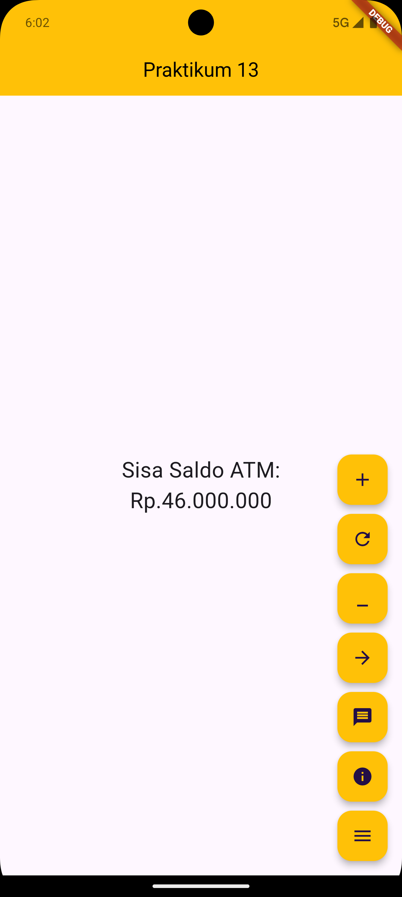
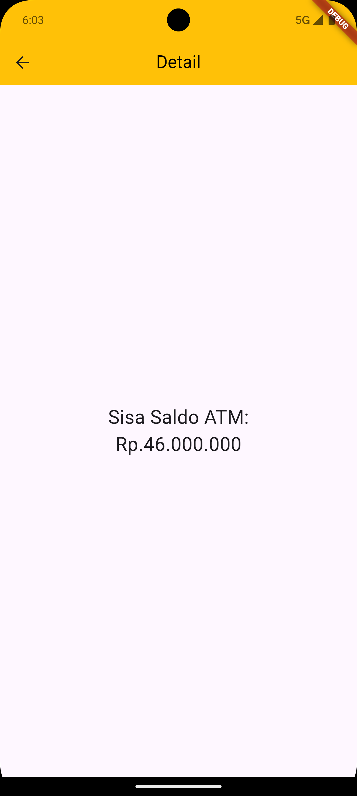
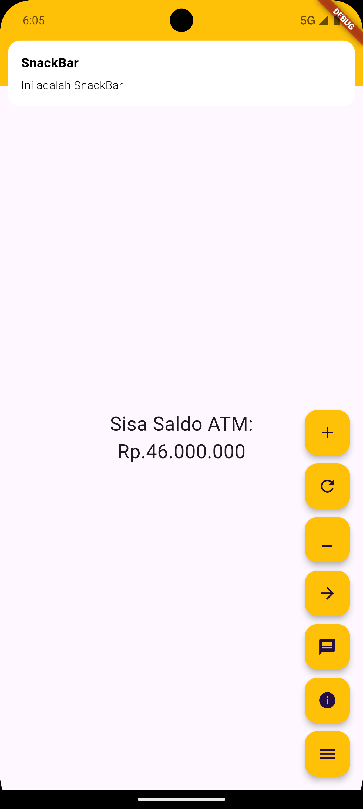
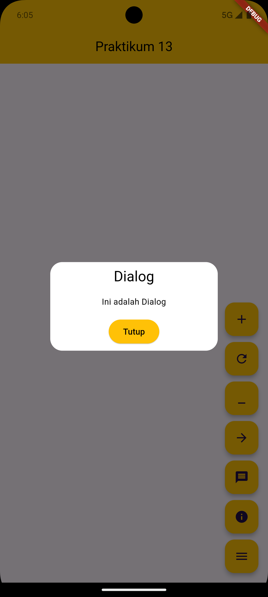
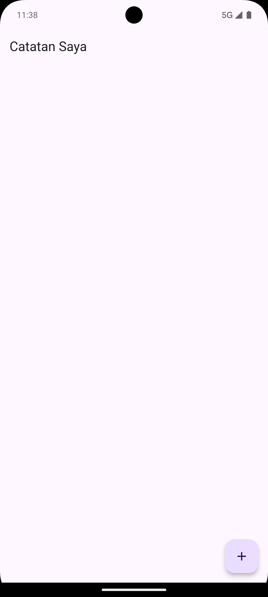
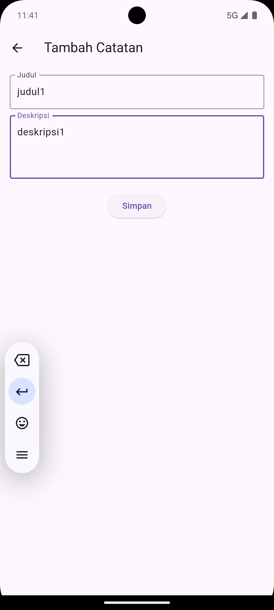
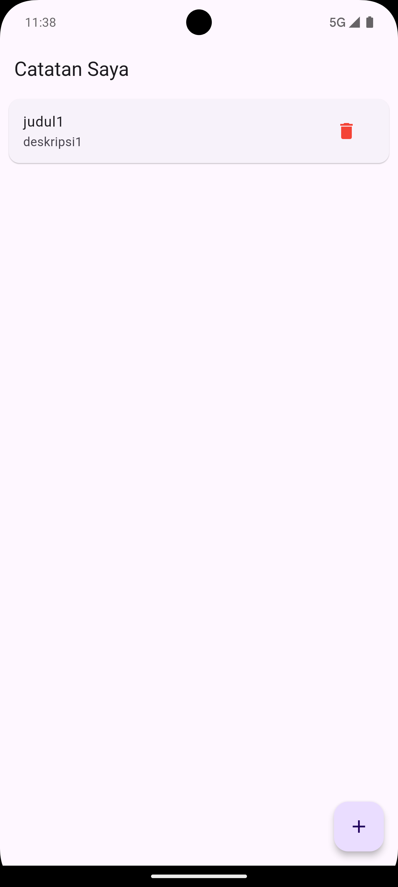

# Cover 
<div align="center">
LAPORAN PRAKTIKUM <br>
PEMROGRAMAN PERANGKAT BERGERAK <br>
<br>
MODUL XIII <br>
NETWORKING <br>


<br>

Disusun Oleh: <br>
Wahyu Isnantia Qodri Ghozali/2211104021 <br>
SE-06-01 <br>

<br>

Asisten Praktikum : <br>
Muhammad Faza Zulian Gesit Al Barru <br>
Aisyah Hasna Aulia <br>

<br>

Dosen Pengampu : <br>
Yudha Islami Sulistya, S.Kom., M.Cs <br>

<br>

PROGRAM STUDI S1 REKAYASSA PERANGKAT LUNAK <br>
FAKULTAS INFORMATIKA <br> 
TELKOM UNIVERSITY PURWOKERTO <br>

</div>

# Guided
## Source Code `main.dart`:
```
import 'package:flutter/material.dart';
import 'package:praktikum13/view/my_home_page.dart';
import 'package:get/get.dart';

void main() {
  runApp(MyApp());
}

class MyApp extends StatelessWidget {
  MyApp({super.key});

  @override
  Widget build(BuildContext context) {
    return GetMaterialApp(
      title: 'Flutter Demo',
      theme: ThemeData(
        colorScheme: ColorScheme.fromSeed(seedColor: Colors.deepPurple),
        useMaterial3: true,
      ),
      home: MyHomepage(
        title: 'Praktikum 13',
      ),
    );
  }
}
```

## Source Code `view/detail_page.dart`:
```
import 'package:flutter/material.dart';
import 'package:get/get.dart';
import 'package:praktikum13/view_model/counter_controller.dart';

class DetailPage extends StatelessWidget {
    DetailPage({super.key, required this.title});

    final String title;
    final CounterController controller = Get.find();

    @override
    Widget build(BuildContext context) {
        return Scaffold(
            appBar: AppBar(
                centerTitle: true,
                title: const Text(
                    "Detail",
                    style: TextStyle(color: Colors.black),
                ),
                backgroundColor: Colors.amber,
            ),
            body: Center(
                child: Obx(() {
                    return Column(
                        mainAxisAlignment: MainAxisAlignment.center,
                        children: [
                            const Text(
                                "Sisa Saldo ATM:",
                                style: TextStyle(fontSize: 24),
                            ),
                            Text(
                                "Rp.${controller.counter.value}.000.000",
                                style: const TextStyle(fontSize: 24),
                            ),
                        ],
                    );
                }),
            ),
        );
    }
}


```
## Source Code `view/my_home_page.dart`:
```
import 'package:flutter/material.dart';
import 'package:get/get.dart';
import 'package:praktikum13/view_model/counter_controller.dart';
import 'package:praktikum13/view/detail_page.dart';

class MyHomepage extends StatelessWidget {
  MyHomepage({super.key, required this.title});

  final String title;

  final CounterController controller = Get.put(CounterController());

  @override
  Widget build(BuildContext context) {
    return Scaffold(
      appBar: AppBar(
        centerTitle: true,
        title: const Text(
          "Praktikum 13",
          style: TextStyle(color: Colors.black),
        ),
        backgroundColor: Colors.amber,
      ),
      body: Center(
        child: Obx(() {
          return Column(
            mainAxisAlignment: MainAxisAlignment.center,
            children: [
              const Text(
                "Sisa Saldo ATM:",
                style: TextStyle(fontSize: 24),
              ),
              Text(
                "Rp.${controller.counter.value}.000.000",
                style: const TextStyle(fontSize: 24),
              ),
            ],
          );
        }),
      ),
      floatingActionButton: Column(
        mainAxisAlignment: MainAxisAlignment.end,
        children: [
          FloatingActionButton(
            heroTag: "increment",
            onPressed: () {
              controller.incrementController();
            },
            child: const Icon(Icons.add),
            backgroundColor: Colors.amber,
          ),
          const SizedBox(height: 10),
          FloatingActionButton(
            heroTag: "reset",
            onPressed: () {
              controller.resetController();
            },
            child: const Icon(Icons.refresh),
            backgroundColor: Colors.amber,
          ),
          const SizedBox(height: 10),
          FloatingActionButton(
            heroTag: "decrement",
            onPressed: () {
              controller.decrementController();
            },
            child: const Icon(Icons.minimize),
            backgroundColor: Colors.amber,
          ),
          const SizedBox(height: 10),
          FloatingActionButton(
            heroTag: "navigate",
            onPressed: () {
              Get.to(() => DetailPage(title: title));
            },
            child: const Icon(Icons.arrow_forward),
            backgroundColor: Colors.amber,
          ),
          const SizedBox(height: 10),
          FloatingActionButton(
            heroTag: "snackbar",
            onPressed: () {
              Get.snackbar("SnackBar", "Ini adalah SnackBar",
                  snackPosition: SnackPosition.BOTTOM,
                  backgroundColor: Colors.amber,
                  colorText: Colors.black);
            },
            child: const Icon(Icons.message),
            backgroundColor: Colors.amber,
          ),
          const SizedBox(height: 10),
          FloatingActionButton(
            heroTag: "dialog",
            onPressed: () {
              Get.defaultDialog(
                title: "Dialog",
                middleText: "Ini adalah Dialog",
                backgroundColor: Colors.amber,
                titleStyle: const TextStyle(color: Colors.black),
                middleTextStyle: const TextStyle(color: Colors.black),
                confirm: ElevatedButton(
                  onPressed: () => Get.back(),
                  style:
                      ElevatedButton.styleFrom(backgroundColor: Colors.black),
                  child: const Text("Tutup",
                      style: TextStyle(color: Colors.amber)),
                ),
              );
            },
            child: const Icon(Icons.info),
            backgroundColor: Colors.amber,
          ),
          const SizedBox(height: 10),
          FloatingActionButton(
            heroTag: "bottomsheet",
            onPressed: () {
              Get.bottomSheet(
                Container(
                  color: Colors.amber,
                  padding: const EdgeInsets.all(20),
                  child: Column(
                    mainAxisSize: MainAxisSize.min,
                    children: [
                      const Text("Ini adalah BottomSheet",
                          style: TextStyle(color: Colors.black, fontSize: 18)),
                      const SizedBox(height: 20),
                      ElevatedButton(
                        onPressed: () => Get.back(),
                        style: ElevatedButton.styleFrom(
                            backgroundColor: Colors.black),
                        child: const Text("Tutup",
                            style: TextStyle(color: Colors.amber)),
                      )
                    ],
                  ),
                ),
              );
            },
            child: const Icon(Icons.menu),
            backgroundColor: Colors.amber,
          ),
        ],
      ),
    );
  }
}

```
## Source Code `view_model/counter_controller.dart`:
```
import 'package:get/get.dart';

class CounterController extends GetxController {
  var counter = 0.obs;

  void incrementController() => counter++;

  void resetController() => counter.value = 0;

  void decrementController() => counter--;
}
```

## Output Code:





## Penjelasan:
Di file `my_home_page.dart` akan dibuat beberapa `FloatingActionButton` dalam sebuah `Column` yang memungkinkan pengguna untuk melakukan berbagai aksi seperti meningkatkan, mereset, atau mengurangi nilai `counter` yang ditampilkan di layar utama, serta navigasi ke halaman detail. Selain itu, tombol ini juga menampilkan *snackbar*, *dialog*, dan *bottomsheet* bawaan GetX, yang memberikan pengalaman interaktif tambahan bagi pengguna. Setiap tombol diberikan properti `heroTag` unik untuk menghindari konflik animasi antar `FloatingActionButton`.

# Unguided

## Source Code `main.dart`:
```
import 'package:flutter/material.dart';
import 'package:get/get.dart';
import 'home_page.dart';

void main() {
  runApp(MyApp());
}

class MyApp extends StatelessWidget {
  @override
  Widget build(BuildContext context) {
    return GetMaterialApp(
      debugShowCheckedModeBanner: false,
      home: HomePage(),
    );
  }
}

```
## Source Code `home_page.dart`:
```
import 'package:flutter/material.dart';
import 'package:get/get.dart';
import 'notes_controller.dart';
import 'add_note_page.dart';

class HomePage extends StatelessWidget {
  final NotesController notesController = Get.put(NotesController());

  @override
  Widget build(BuildContext context) {
    return Scaffold(
      appBar: AppBar(
        title: Text('Catatan Saya'),
      ),
      body: Obx(
        () => ListView.builder(
          itemCount: notesController.notes.length,
          itemBuilder: (context, index) {
            final note = notesController.notes[index];
            return Card(
              margin: EdgeInsets.symmetric(vertical: 5, horizontal: 10),
              child: ListTile(
                title: Text(note.title),
                subtitle: Text(note.description),
                trailing: IconButton(
                  icon: Icon(Icons.delete, color: Colors.red),
                  onPressed: () => notesController.deleteNoteAt(index),
                ),
              ),
            );
          },
        ),
      ),
      floatingActionButton: FloatingActionButton(
        onPressed: () {
          Get.to(() => AddNotePage());
        },
        child: Icon(Icons.add),
      ),
    );
  }
}

```
## Source Code `add_note_page.dart`:
```
import 'package:flutter/material.dart';
import 'package:get/get.dart';
import 'notes_controller.dart';

class AddNotePage extends StatelessWidget {
  final NotesController notesController = Get.find();
  final TextEditingController titleController = TextEditingController();
  final TextEditingController descriptionController = TextEditingController();

  @override
  Widget build(BuildContext context) {
    return Scaffold(
      appBar: AppBar(
        title: Text('Tambah Catatan'),
      ),
      body: Padding(
        padding: const EdgeInsets.all(16.0),
        child: Column(
          children: [
            TextField(
              controller: titleController,
              decoration: InputDecoration(
                labelText: 'Judul',
                border: OutlineInputBorder(),
              ),
            ),
            SizedBox(height: 10),
            TextField(
              controller: descriptionController,
              decoration: InputDecoration(
                labelText: 'Deskripsi',
                border: OutlineInputBorder(),
              ),
              maxLines: 3,
            ),
            SizedBox(height: 20),
            ElevatedButton(
              onPressed: () {
                final title = titleController.text.trim();
                final description = descriptionController.text.trim();

                if (title.isNotEmpty && description.isNotEmpty) {
                  notesController.addNote(title, description);
                  Get.back();
                } else {
                  Get.snackbar('Error', 'Judul dan Deskripsi tidak boleh kosong.',
                      snackPosition: SnackPosition.BOTTOM);
                }
              },
              child: Text('Simpan'),
            )
          ],
        ),
      ),
    );
  }
}

```
## Source Code `notes_controller.dart`:
```
import 'package:get/get.dart';

class Note {
  String title;
  String description;

  Note({required this.title, required this.description});
}

class NotesController extends GetxController {
  var notes = <Note>[].obs;

  void addNote(String title, String description) {
    notes.add(Note(title: title, description: description));
  }

  void deleteNoteAt(int index) {
    notes.removeAt(index);
  }
}

```

## Output Code:




## Penjelasan:
Di file `main.dart` akan menginisialisasi aplikasi Flutter menggunakan `GetMaterialApp` dan menampilkan halaman utama `HomePage` sebagai layar pertama.
Di file `home_page.dart` akan menampilkan daftar catatan yang dikelola oleh `NotesController`. Catatan ditampilkan menggunakan `ListView.builder`, dan pengguna dapat menghapus catatan atau berpindah ke halaman `AddNotePage` dengan tombol floating action.
Di file `add_note_page.dart` akan menyediakan formulir untuk menambahkan catatan baru. Setelah pengguna mengisi judul dan deskripsi, catatan tersebut disimpan ke dalam `NotesController`, dan aplikasi kembali ke halaman utama.
Di file `notes_controller.dart` akan mendefinisikan model `Note` dan mengelola daftar catatan dengan fitur untuk menambahkan dan menghapus catatan menggunakan pendekatan reaktif dengan `GetX`.