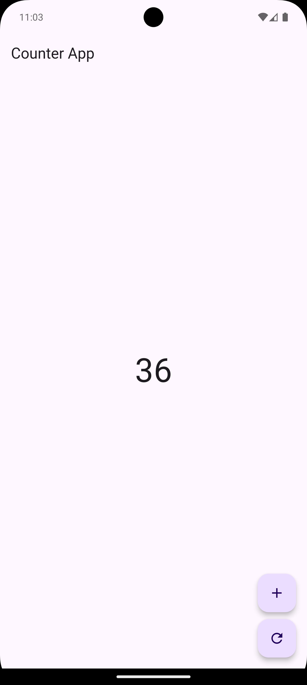
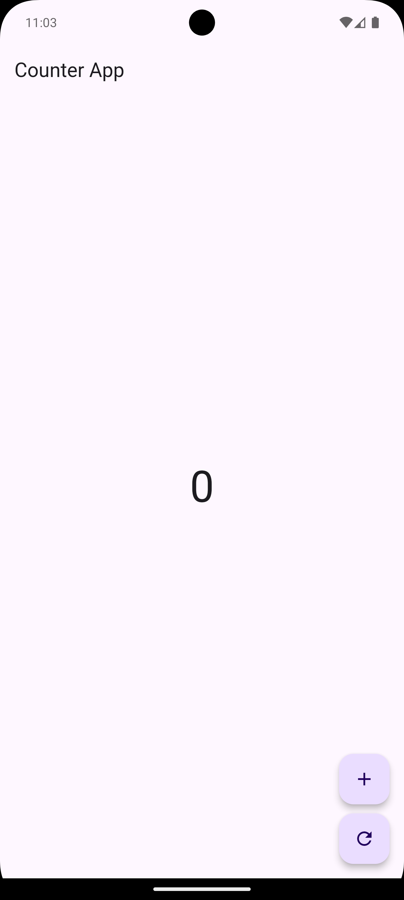

# Cover #
<div align="center">
TUGAS PENDAHULUAN<br>
PEMROGRAMAN PERANGKAT BERGERAK <br>
<br>
MODUL XIII <br>
NETWORKING <br>


<br>

Disusun Oleh: <br>
Wahyu Isnantia Qodri Ghozali/2211104021 <br>
SE-06-01 <br>

<br>

Asisten Praktikum : <br>
Muhammad Faza Zulian Gesit Al Barru <br>
Aisyah Hasna Aulia <br>

<br>

Dosen Pengampu : <br>
Yudha Islami Sulistya, S.Kom., M.Cs <br>

<br>

PROGRAM STUDI S1 REKAYASSA PERANGKAT LUNAK <br>
FAKULTAS INFORMATIKA <br> 
TELKOM UNIVERSITY PURWOKERTO <br>

</div>

# Jawaban Soal

## 1. Apa yang dimaksud dengan state management pada Flutter?
State management pada Flutter merujuk pada cara mengelola dan memperbarui data atau status aplikasi yang mempengaruhi tampilan UI. Ini penting untuk menjaga agar UI tetap sinkron dengan data yang berubah, seperti input pengguna atau respons dari server. State management dapat dilakukan dengan berbagai pendekatan, seperti menggunakan `setState()`, Provider, Riverpod, Bloc, atau GetX.
## 2. Sebut dan jelaskan komponen-komponen yang ada di dalam GetX
GetX memiliki beberapa komponen utama yang membantu dalam pengelolaan state, navigasi, dan dependensi di Flutter:

1. **GetxController**: Digunakan untuk mengelola state aplikasi. Ini adalah kelas yang berisi logika bisnis dan data yang akan dibagikan ke UI.

2. **Rx (Reactive) Variables**: Variabel yang bersifat observabel (`obs`), memungkinkan UI untuk merespons perubahan data secara otomatis tanpa perlu manual setState.

3. **GetBuilder**: Digunakan untuk memperbarui UI ketika ada perubahan pada state yang dikelola oleh `GetxController`. Ini memberi kontrol lebih atas pengelolaan state.

4. **Obx**: Widget yang secara otomatis memperbarui UI saat ada perubahan pada `Rx` variables dalam `GetxController`.

5. **Get.put()**: Digunakan untuk mendaftarkan dan menginisialisasi dependensi atau controller yang akan digunakan di aplikasi.

6. **Get.off() dan Get.to()**: Digunakan untuk navigasi antar halaman. `Get.to()` untuk menavigasi ke halaman baru, sementara `Get.off()` digunakan untuk mengganti halaman saat ini.

7. **GetX**: Merupakan widget yang mengintegrasikan state management, yang memudahkan dalam pengelolaan UI dan logika aplikasi.
## 3. Lengkapilah code di bawah ini, dan tampilkan hasil outputnya serta jelaskan.
```
import 'package:flutter/material.dart';
import 'package:get/get.dart';

/// Controller untuk mengelola state counter
class CounterController extends GetxController {
// TODO: Tambahkan variabel untuk menyimpan nilai counter
// TODO: Buat fungsi untuk menambah nilai counter
// TODO: Buat fungsi untuk mereset nilai counter
}

class HomePage extends StatelessWidget {
  final CounterController controller = Get.put(CounterController());
  @override
  Widget build(BuildContext context) {
    return Scaffold(
      appBar: AppBar(title: Text("Counter App")),
      body: Center(
        child: Obx(() {
// TODO: Lengkapi logika untuk menampilkan nilai counter
          return Text(
            "0", // Ganti ini dengan nilai counter
            style: TextStyle(fontSize: 48),
          );
        }),
      ),
      floatingActionButton: Column(
        mainAxisAlignment: MainAxisAlignment.end,
        children: [
          FloatingActionButton(
            onPressed: () {
// TODO: Tambahkan logika untuk menambah nilai counter
            },
            child: Icon(Icons.add),
          ),
          SizedBox(height: 10),
          FloatingActionButton(
            onPressed: () {
// TODO: Tambahkan logika untuk mereset nilai counter
            },
            child: Icon(Icons.refresh),
          ),
        ],
      ),
    );
  }
}

void main() {
  runApp(MaterialApp(
    debugShowCheckedModeBanner: false,
    home: HomePage(),
  ));
}

```
Jawaban:
```
import 'package:flutter/material.dart';
import 'package:get/get.dart';

/// Controller untuk mengelola state counter
class CounterController extends GetxController {
  // Variabel untuk menyimpan nilai counter
  var counter = 0.obs;

  // Fungsi untuk menambah nilai counter
  void increment() {
    counter++;
  }

  // Fungsi untuk mereset nilai counter
  void reset() {
    counter.value = 0;
  }
}

class HomePage extends StatelessWidget {
  final CounterController controller = Get.put(CounterController());
  
  @override
  Widget build(BuildContext context) {
    return Scaffold(
      appBar: AppBar(title: Text("Counter App")),
      body: Center(
        child: Obx(() {
          // Menampilkan nilai counter yang diupdate secara otomatis
          return Text(
            controller.counter.value.toString(),
            style: TextStyle(fontSize: 48),
          );
        }),
      ),
      floatingActionButton: Column(
        mainAxisAlignment: MainAxisAlignment.end,
        children: [
          FloatingActionButton(
            onPressed: () {
              // Menambah nilai counter
              controller.increment();
            },
            child: Icon(Icons.add),
          ),
          SizedBox(height: 10),
          FloatingActionButton(
            onPressed: () {
              // Mereset nilai counter
              controller.reset();
            },
            child: Icon(Icons.refresh),
          ),
        ],
      ),
    );
  }
}

void main() {
  runApp(MaterialApp(
    debugShowCheckedModeBanner: false,
    home: HomePage(),
  ));
}

```

## Output Code:



## Deskripsi Code:
Program ini adalah aplikasi counter sederhana yang menggunakan GetX untuk mengelola state dan memperbarui tampilan UI. Di file `CounterController.dart`, akan didefinisikan sebuah controller yang menyimpan nilai counter sebagai variabel observable dengan tipe `RxInt`. Ketika tombol "+" ditekan, fungsi `increment()` akan dipanggil untuk menambah nilai counter, sedangkan tombol "refresh" akan memanggil fungsi `reset()` untuk mengatur ulang nilai counter menjadi 0. Di file `HomePage.dart`, UI akan menampilkan nilai counter menggunakan widget `Obx`, yang secara otomatis memperbarui tampilan setiap kali nilai counter berubah. GetX menangani reaktivitas ini sehingga pengembang tidak perlu menulis kode tambahan untuk merender ulang UI secara manual. Output yang dihasilkan adalah tampilan angka yang terupdate sesuai dengan interaksi pengguna dengan tombol "+" atau "refresh". Program ini memanfaatkan konsep state management untuk memastikan UI selalu sinkron dengan data yang ada.