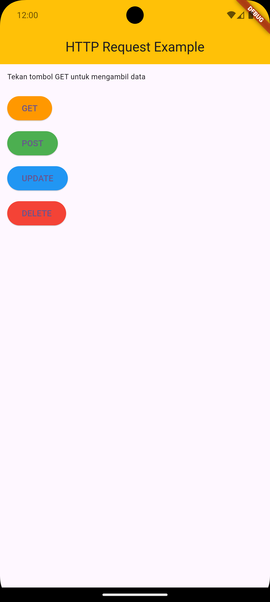
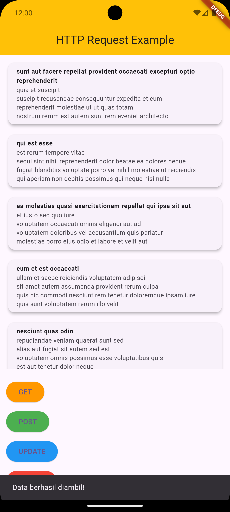
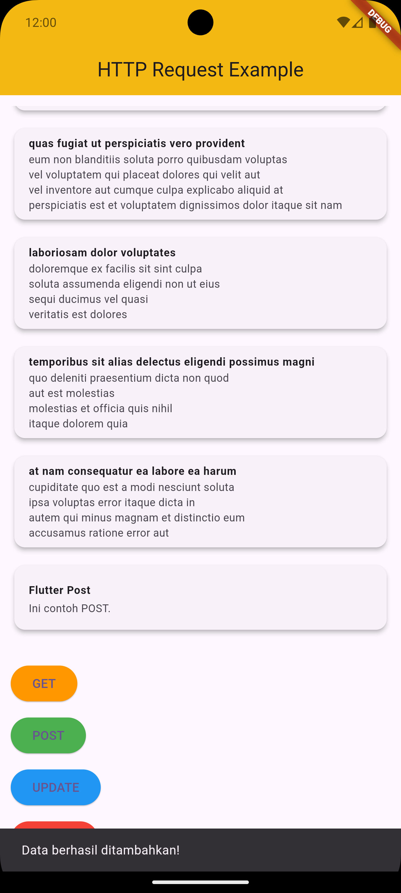
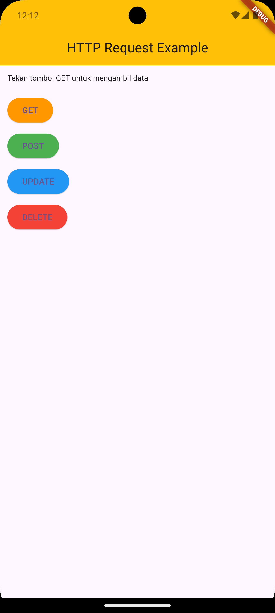
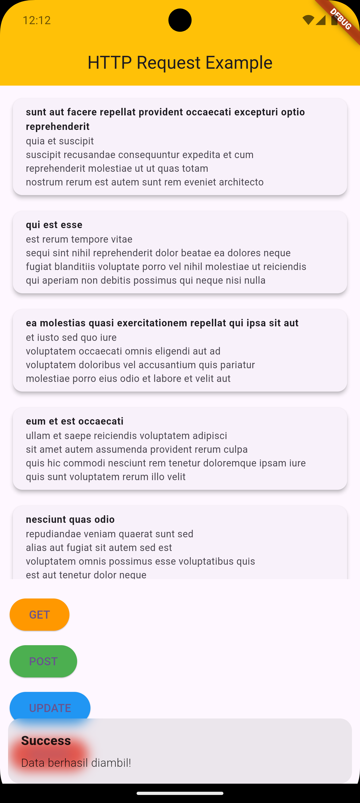
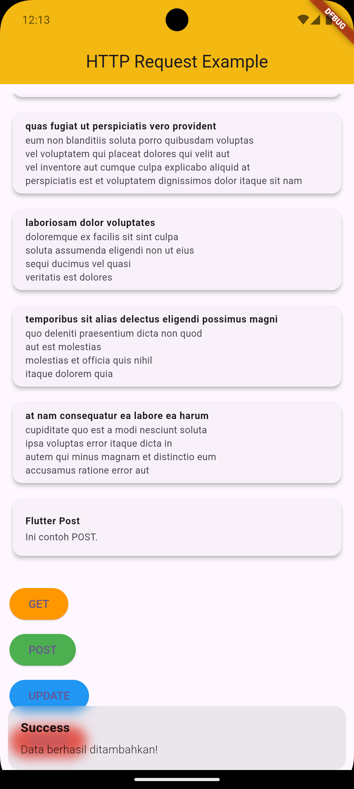
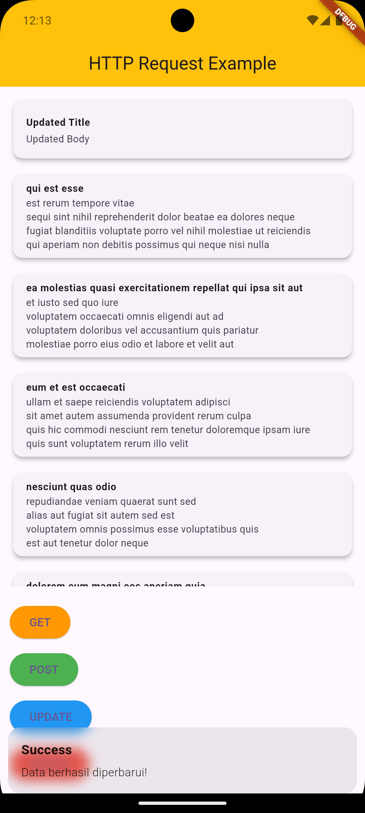
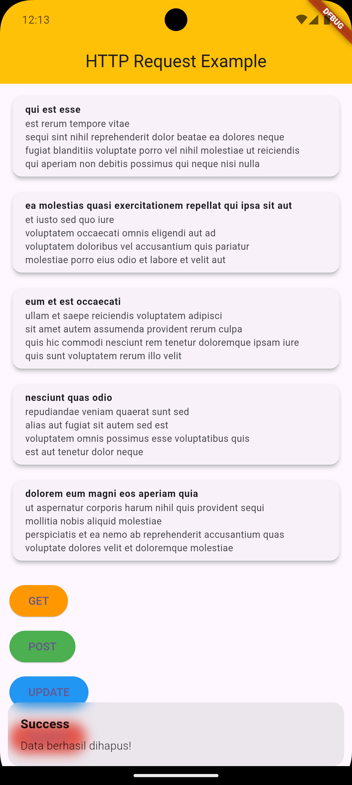

# Cover 
<div align="center">
LAPORAN PRAKTIKUM <br>
PEMROGRAMAN PERANGKAT BERGERAK <br>
<br>
MODUL XIV <br>
DATA STORAGE (API) <br>


<br>

Disusun Oleh: <br>
Wahyu Isnantia Qodri Ghozali/2211104021 <br>
SE-06-01 <br>

<br>

Asisten Praktikum : <br>
Muhammad Faza Zulian Gesit Al Barru <br>
Aisyah Hasna Aulia <br>

<br>

Dosen Pengampu : <br>
Yudha Islami Sulistya, S.Kom., M.Cs <br>

<br>

PROGRAM STUDI S1 REKAYASSA PERANGKAT LUNAK <br>
FAKULTAS INFORMATIKA <br> 
TELKOM UNIVERSITY PURWOKERTO <br>

</div>

# Guided
## Menambahkan depedency http di `pubsec.yaml`:

```
dependencies:
  flutter:
  http: ^1.2.2
```

## Memberi akses internet di `android/app/src/main/AndroidManifest.xml`:

```
<uses-permission android:name="android.permission.INTERNET"/> 
```

## Source Code `main.dart`:

```
import 'package:flutter/material.dart';
import 'package:praktikum14/screens/home_screen.dart';

void main() {
  runApp(const MyApp());
}

class MyApp extends StatelessWidget {
  const MyApp({super.key});

  @override
  Widget build(BuildContext context) {
    return MaterialApp(
      title: 'Flutter Demo',
      theme: ThemeData(
        colorScheme: ColorScheme.fromSeed(seedColor: Colors.deepPurple),
        useMaterial3: true,
      ),
      home: const HomeScreen(),
    );
  }
}
```

## Source Code `screens/home_screen.dart`:

```
import 'package:flutter/material.dart';
import 'package:praktikum14/services/api_services.dart';

class HomeScreen extends StatefulWidget {
  const HomeScreen({super.key});

  @override
  State<HomeScreen> createState() => _HomeScreenState();
}

class _HomeScreenState extends State<HomeScreen> {
  List<dynamic> _posts = []; // Menyimpan list posts
  bool _isLoading = false; // Untuk indikator loading
  final ApiService _apiService = ApiService(); // Instance ApiService
// Fungsi untuk menampilkan SnackBar
  void _showSnackBar(String message) {
    ScaffoldMessenger.of(context)
        .showSnackBar(SnackBar(content: Text(message)));
  }

// Fungsi untuk memanggil API dan menangani operasi
  Future<void> _handleApiOperation(
      Future<void> operation, String successMessage) async {
    setState(() {
      _isLoading = true;
    });
    try {
      await operation; // Menjalankan operasi API
      setState(() {
        _posts = _apiService.posts;
      });
      _showSnackBar(successMessage);
    } catch (e) {
      _showSnackBar('Error: $e');
    } finally {
      setState(() {
        _isLoading = false;
      });
    }
  }

  @override
  Widget build(BuildContext context) {
    return Scaffold(
      appBar: AppBar(
        title: const Text('HTTP Request Example'),
        centerTitle: true,
        backgroundColor: Colors.amber,
      ),
      body: Padding(
        padding: const EdgeInsets.all(12.0),
        child: Column(
          crossAxisAlignment: CrossAxisAlignment.start,
          children: [
            _isLoading
                ? const Center(child: CircularProgressIndicator())
                : _posts.isEmpty
                    ? const Text(
                        "Tekan tombol GET untuk mengambil data",
                        style: TextStyle(fontSize: 12),
                      )
                    : Expanded(
                        child: ListView.builder(
                          itemCount: _posts.length,
                          itemBuilder: (context, index) {
                            return Padding(
                              padding: const EdgeInsets.only(bottom: 12.0),
                              child: Card(
                                elevation: 4,
                                child: ListTile(
                                  title: Text(
                                    _posts[index]['title'],
                                    style: const TextStyle(
                                        fontWeight: FontWeight.bold,
                                        fontSize: 12),
                                  ),
                                  subtitle: Text(
                                    _posts[index]['body'],
                                    style: const TextStyle(fontSize: 12),
                                  ),
                                ),
                              ),
                            );
                          },
                        ),
                      ),
            const SizedBox(height: 20),
            ElevatedButton(
              onPressed: () => _handleApiOperation(
                  _apiService.fetchPosts(), 'Data berhasil diambil!'),
              style: ElevatedButton.styleFrom(backgroundColor: Colors.orange),
              child: const Text('GET'),
            ),
            const SizedBox(height: 10),
            ElevatedButton(
              onPressed: () => _handleApiOperation(
                  _apiService.createPost(), 'Data berhasil ditambahkan!'),
              style: ElevatedButton.styleFrom(backgroundColor: Colors.green),
              child: const Text('POST'),
            ),
            const SizedBox(height: 10),
            ElevatedButton(
              onPressed: () => _handleApiOperation(
                  _apiService.updatePost(), 'Data berhasil diperbarui!'),
              style: ElevatedButton.styleFrom(backgroundColor: Colors.blue),
              child: const Text('UPDATE'),
            ),
            const SizedBox(height: 10),
            ElevatedButton(
              onPressed: () => _handleApiOperation(
                  _apiService.deletePost(), 'Data berhasil dihapus!'),
              style: ElevatedButton.styleFrom(backgroundColor: Colors.red),
              child: const Text('DELETE'),
            ),
          ],
        ),
      ),
    );
  }
}

```

## Source Code `services/api_services.dart`:

```
import 'dart:convert';
import 'package:http/http.dart' as http;

class ApiService {
  final String baseUrl = "https://jsonplaceholder.typicode.com";
  List<dynamic> posts = []; // Menyimpan data post yang diterima
// Fungsi untuk GET data
  Future<void> fetchPosts() async {
    final response = await http.get(Uri.parse('$baseUrl/posts'));
    if (response.statusCode == 200) {
      posts = json.decode(response.body);
    } else {
      throw Exception('Failed to load posts');
    }
  }

  // Fungsi untuk POST data
  Future<void> createPost() async {
    final response = await http.post(
      Uri.parse('$baseUrl/posts'),
      headers: {'Content-Type': 'application/json'},
      body: json.encode({
        'title': 'Flutter Post',
        'body': 'Ini contoh POST.',
        'userId': 1,
      }),
    );
    if (response.statusCode == 201) {
      posts.add({
        'title': 'Flutter Post',
        'body': 'Ini contoh POST.',
        'id': posts.length + 1,
      });
    } else {
      throw Exception('Failed to create post');
    }
  }

  // Fungsi untuk UPDATE data
  Future<void> updatePost() async {
    final response = await http.put(
      Uri.parse('$baseUrl/posts/1'),
      body: json.encode({
        'title': 'Updated Title',
        'body': 'Updated Body',
        'userId': 1,
      }),
    );
    if (response.statusCode == 200) {
      final updatedPost = posts.firstWhere((post) => post['id'] == 1);
      updatedPost['title'] = 'Updated Title';
      updatedPost['body'] = 'Updated Body';
    } else {
      throw Exception('Failed to update post');
    }
  }

  // Fungsi untuk DELETE data
  Future<void> deletePost() async {
    final response = await http.delete(
      Uri.parse('$baseUrl/posts/1'),
    );
    if (response.statusCode == 200) {
      posts.removeWhere((post) => post['id'] == 1);
    } else {
      throw Exception('Failed to delete post');
    }
  }
}

```

## Output Code:





## Deskripsi:
Di file main.dart akan memulai aplikasi Flutter dengan mendefinisikan kelas MyApp sebagai root aplikasi. Kelas ini memanggil widget HomeScreen sebagai halaman awal, yang mendemonstrasikan penggunaan HTTP request.

Di file services/api_services.dart akan menyediakan layanan API untuk melakukan berbagai operasi HTTP (GET, POST, PUT, DELETE).

- Fungsi fetchPosts akan mengambil data dari API menggunakan metode GET dan menyimpannya ke dalam list posts.
- Fungsi createPost akan mengirimkan data baru ke API menggunakan metode POST dan menambahkan data tersebut ke dalam list posts jika berhasil.
- Fungsi updatePost akan memperbarui data yang ada di API menggunakan metode PUT, dan jika berhasil, akan mengupdate data di list posts.
- Fungsi deletePost akan menghapus data di API menggunakan metode DELETE dan menghapus data dari list posts jika berhasil.
- Di file screens/home_screen.dart akan menjadi antarmuka pengguna untuk berinteraksi dengan API.

Komponen HomeScreen adalah stateful widget yang menyimpan data post dan status loading.
- Fungsi _showSnackBar akan menampilkan pesan pada layar menggunakan SnackBar.
- Fungsi _handleApiOperation akan menangani proses panggilan API, mengatur status loading, memperbarui list posts, dan menampilkan notifikasi hasil operasi.


# Unguided
## Menambahkan depedency get di `pubspec.yaml`:
```
dependencies:
  get: ^4.6.6
```

## Source Code `main.dart`:
```
import 'package:flutter/material.dart';
import 'package:get/get.dart';
import 'package:praktikum14/screens/home_screen.dart';

void main() {
  runApp(const MyApp());
}

class MyApp extends StatelessWidget {
  const MyApp({super.key});

  @override
  Widget build(BuildContext context) {
    return GetMaterialApp(
      title: 'Flutter Demo',
      theme: ThemeData(
        colorScheme: ColorScheme.fromSeed(seedColor: Colors.deepPurple),
        useMaterial3: true,
      ),
      home: const HomeScreen(),
    );
  }
}
```

## Source Code `screens/home_screen.dart`:
```
import 'package:flutter/material.dart';
import 'package:get/get.dart';
import 'package:praktikum14/services/api_services.dart';

class HomeScreen extends StatelessWidget {
  const HomeScreen({super.key});

  @override
  Widget build(BuildContext context) {
    final ApiController apiController = Get.put(ApiController());

    return Scaffold(
      appBar: AppBar(
        title: const Text('HTTP Request Example'),
        centerTitle: true,
        backgroundColor: Colors.amber,
      ),
      body: Padding(
        padding: const EdgeInsets.all(12.0),
        child: Column(
          crossAxisAlignment: CrossAxisAlignment.start,
          children: [
            Obx(() => apiController.isLoading.value
                ? const Center(child: CircularProgressIndicator())
                : apiController.posts.isEmpty
                    ? const Text(
                        "Tekan tombol GET untuk mengambil data",
                        style: TextStyle(fontSize: 12),
                      )
                    : Expanded(
                        child: ListView.builder(
                          itemCount: apiController.posts.length,
                          itemBuilder: (context, index) {
                            return Padding(
                              padding: const EdgeInsets.only(bottom: 12.0),
                              child: Card(
                                elevation: 4,
                                child: ListTile(
                                  title: Text(
                                    apiController.posts[index]['title'],
                                    style: const TextStyle(
                                        fontWeight: FontWeight.bold,
                                        fontSize: 12),
                                  ),
                                  subtitle: Text(
                                    apiController.posts[index]['body'],
                                    style: const TextStyle(fontSize: 12),
                                  ),
                                ),
                              ),
                            );
                          },
                        ),
                      )),
            const SizedBox(height: 20),
            ElevatedButton(
              onPressed: apiController.fetchPosts,
              style: ElevatedButton.styleFrom(backgroundColor: Colors.orange),
              child: const Text('GET'),
            ),
            const SizedBox(height: 10),
            ElevatedButton(
              onPressed: apiController.createPost,
              style: ElevatedButton.styleFrom(backgroundColor: Colors.green),
              child: const Text('POST'),
            ),
            const SizedBox(height: 10),
            ElevatedButton(
              onPressed: () => apiController.updatePost(1),
              style: ElevatedButton.styleFrom(backgroundColor: Colors.blue),
              child: const Text('UPDATE'),
            ),
            const SizedBox(height: 10),
            ElevatedButton(
              onPressed: () => apiController.deletePost(1),
              style: ElevatedButton.styleFrom(backgroundColor: Colors.red),
              child: const Text('DELETE'),
            ),
          ],
        ),
      ),
    );
  }
}
```

## Source Code `services/api_services.dart`:
```
import 'dart:convert';
import 'package:get/get.dart';
import 'package:http/http.dart' as http;

class ApiController extends GetxController {
  final String baseUrl = "https://jsonplaceholder.typicode.com";
  var posts = <dynamic>[].obs; // Observable list untuk data post
  var isLoading = false.obs; // Observable untuk status loading

  // Fungsi untuk GET data
  Future<void> fetchPosts() async {
    isLoading.value = true;
    try {
      final response = await http.get(Uri.parse('$baseUrl/posts'));
      if (response.statusCode == 200) {
        posts.value = json.decode(response.body);
        Get.snackbar('Success', 'Data berhasil diambil!',
            snackPosition: SnackPosition.BOTTOM);
      } else {
        throw Exception('Failed to load posts');
      }
    } catch (e) {
      Get.snackbar('Error', e.toString(), snackPosition: SnackPosition.BOTTOM);
    } finally {
      isLoading.value = false;
    }
  }

  // Fungsi untuk POST data
  Future<void> createPost() async {
    isLoading.value = true;
    try {
      final response = await http.post(
        Uri.parse('$baseUrl/posts'),
        headers: {'Content-Type': 'application/json'},
        body: json.encode({
          'title': 'Flutter Post',
          'body': 'Ini contoh POST.',
          'userId': 1,
        }),
      );
      if (response.statusCode == 201) {
        posts.add(json.decode(response.body));
        Get.snackbar('Success', 'Data berhasil ditambahkan!',
            snackPosition: SnackPosition.BOTTOM);
      } else {
        throw Exception('Failed to create post');
      }
    } catch (e) {
      Get.snackbar('Error', e.toString(), snackPosition: SnackPosition.BOTTOM);
    } finally {
      isLoading.value = false;
    }
  }

  // Fungsi untuk UPDATE data
  Future<void> updatePost(int id) async {
    isLoading.value = true;
    try {
      final response = await http.put(
        Uri.parse('$baseUrl/posts/$id'),
        headers: {'Content-Type': 'application/json'},
        body: json.encode({
          'title': 'Updated Title',
          'body': 'Updated Body',
          'userId': 1,
        }),
      );
      if (response.statusCode == 200) {
        final updatedPost = posts.firstWhere((post) => post['id'] == id);
        updatedPost['title'] = 'Updated Title';
        updatedPost['body'] = 'Updated Body';
        posts.refresh(); // Refresh data di list
        Get.snackbar('Success', 'Data berhasil diperbarui!',
            snackPosition: SnackPosition.BOTTOM);
      } else {
        throw Exception('Failed to update post');
      }
    } catch (e) {
      Get.snackbar('Error', e.toString(), snackPosition: SnackPosition.BOTTOM);
    } finally {
      isLoading.value = false;
    }
  }

  // Fungsi untuk DELETE data
  Future<void> deletePost(int id) async {
    isLoading.value = true;
    try {
      final response = await http.delete(Uri.parse('$baseUrl/posts/$id'));
      if (response.statusCode == 200) {
        posts.removeWhere((post) => post['id'] == id);
        Get.snackbar('Success', 'Data berhasil dihapus!',
            snackPosition: SnackPosition.BOTTOM);
      } else {
        throw Exception('Failed to delete post');
      }
    } catch (e) {
      Get.snackbar('Error', e.toString(), snackPosition: SnackPosition.BOTTOM);
    } finally {
      isLoading.value = false;
    }
  }
}
```

## Output Code:






## Deskripsi:
Di file `main.dart` akan dibuat entry point aplikasi dan inisialisasi library GetX untuk state management dengan mengubah penggunaan `MaterialApp` menjadi `GetMaterialApp`. Hal ini memungkinkan integrasi penuh dengan fitur GetX.

Di file `services/api_services.dart` akan tetap digunakan untuk komunikasi HTTP, tetapi data yang sebelumnya dikelola di dalam `ApiService` akan dimigrasikan ke controller yang dibuat menggunakan GetX agar lebih terorganisir dan mengikuti pola state management.

Di file baru `controllers/post_controller.dart` akan dibuat sebuah controller menggunakan GetX untuk mengelola data post dan menangani operasi seperti GET, POST, UPDATE, dan DELETE. Controller ini akan memanfaatkan `RxList` untuk memastikan data diperbarui secara otomatis di UI.

Di file `screens/home_screen.dart` akan dimodifikasi untuk memanfaatkan GetX melalui widget `Obx`, yang memungkinkan tampilan diperbarui secara otomatis setiap kali ada perubahan pada data. Fungsi-fungsi yang sebelumnya ada di widget ini akan digantikan oleh metode-metode yang ada di controller. Selain itu, snackbar akan ditampilkan menggunakan `Get.snackbar` setiap kali operasi API berhasil dilakukan.